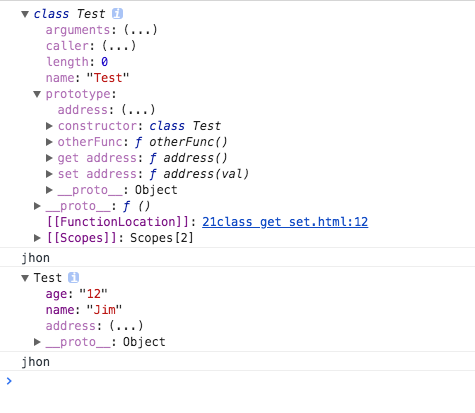

### 1 对象的扩展

```javascript
let o = {
    _name : 'Jim',
    get name(){
        console.log('222');
        return this._name
    },
    set name(v){
        this._name = v
    }
}
Object.defineProperty(o,'testSet',{
    enumerable:true,
    configurable:true,
    set() {
        console.log('testSet')
    },
    get() {
        return 'getTEST'
    }
})
console.dir(o);
console.log(o._name)
console.log(o.name)
o.name = 'Jhon'
console.log(o._name)  
```


### 2 class 定义类的时候，使用对象的扩展语法

```javascript
class Test {
    constructor() {
        this.name = 'Jim';
        this.age = '12';
    }
    get address() {
        return 'jhon'
    }
    set address(val) {
        console.log(333);
        this.age = val;
    }
    otherFunc() {
        console.log('otherFunc')
    }
}
console.dir(Test)
console.dir(Test.prototype.address)
console.dir(new Test())
console.dir(new Test().address)
```



### 3 核心还是在于 class 这个语法糖，其实等价于

```javascript
function Test() {
    this.name = 'Jim';
    this.age = '12';
}
Test.prototype = {
    get address() {
        return 'jhon'
    },
    set address(val) {
        console.log(333);
        this.age = val;
    },
    otherFunc() {
        console.log('otherFunc')
    },
}
```

