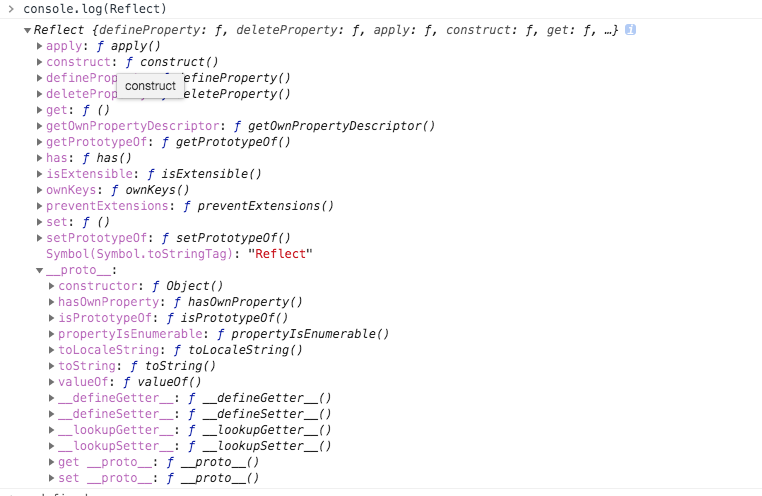

Reflect
---
与大多数全局对象不同Reflect并非一个构造函数，所以不能通过new运算符对其进行调用，或者将Reflect对象作为一个函数来调用。Reflect的所有属性和方法都是静态的（就像Math对象）。

Reflect 对象提供了以下静态方法，这些方法与proxy handler methods的命名相同.

其中的一些方法与 Object相同, 尽管二者之间存在 某些细微上的差别 .

我们可以通过输出 Reflect 的值可以看到这个是一个全局对象



```
静态方法
Reflect.apply(target, thisArgument, argumentsList)
对一个函数进行调用操作，同时可以传入一个数组作为调用参数。和 Function.prototype.apply() 功能类似。
Reflect.construct(target, argumentsList[, newTarget])
对构造函数进行 new 操作，相当于执行 new target(...args)。
Reflect.defineProperty(target, propertyKey, attributes)
和 Object.defineProperty() 类似。如果设置成功就会返回 true
Reflect.deleteProperty(target, propertyKey)
作为函数的delete操作符，相当于执行 delete target[name]。
Reflect.get(target, propertyKey[, receiver])
获取对象身上某个属性的值，类似于 target[name]。
Reflect.getOwnPropertyDescriptor(target, propertyKey)
类似于 Object.getOwnPropertyDescriptor()。如果对象中存在该属性，则返回对应的属性描述符,  否则返回 undefined.
Reflect.getPrototypeOf(target)
类似于 Object.getPrototypeOf()。
Reflect.has(target, propertyKey)
判断一个对象是否存在某个属性，和 in 运算符 的功能完全相同。
Reflect.isExtensible(target)
类似于 Object.isExtensible().
Reflect.ownKeys(target)
返回一个包含所有自身属性（不包含继承属性）的数组。(类似于 Object.keys(), 但不会受enumerable影响).
Reflect.preventExtensions(target)
类似于 Object.preventExtensions()。返回一个Boolean。
Reflect.set(target, propertyKey, value[, receiver])
将值分配给属性的函数。返回一个Boolean，如果更新成功，则返回true。
Reflect.setPrototypeOf(target, prototype)
设置对象原型的函数. 返回一个 Boolean， 如果更新成功，则返回true。

```
基本使用如下
```javascript
/*
    * for-in : 可以遍历到原型和自身的 可枚举以及不可枚举属性，不包括symbol属性
    * Object.keys() :可以遍历到对象自身所有 可枚举和不可枚举属性，不包括symbol属性，区别于for-in是不能遍历原型上的属性
    * Object.getOwnPropertyNames() :可以遍历到对象自身的所有 可枚举属性，不可枚举属性，不包括symbol属性
    * Object.getOwnPropertySymbols() :可以遍历到对象自身所有的 symbol属性
    * Object.prototype.hasOwnProperty(props) :可以用来判断某个对象是否包含某个属性，包括可枚举属性，不可枚举属性以及symbol属性
    * Object.getOwnPropertyDescriptors( o ) :可以获取对象o的所有属性描述的集合，包括可枚举属性，不可枚举属性，以及symbol属性
    */
    //构造一个对象，满足各种条件
    var obj = Object.create({foo:0},{
      bar1:{ // 不可枚举；
        value:1//descriptor默认值 enumerable fasle configurable false writable false
      },
      bar2:{
        value:2,
        enumerable:true
      }
    });
    var sKey = Symbol();
    obj[sKey] = 'symbolKeyValue';
    //返回一个包含所有自身属性（不包含继承属性）的数组。(类似于 Object.keys(), 但不会受enumerable影响).
    //Object.prototype.hasOwnProperty.call(obj,sKey) :true
    const RKeys = Reflect.ownKeys(obj);
    console.log('RKeys',RKeys)
    //返回一个包含所有给定对象自身可枚举属性名称的数组。但是不包括symbol
    const Okeys = Object.keys(obj);
    console.log('Okeys',Okeys);
    const ownDescriptors = Reflect.getOwnPropertyDescriptor(obj,sKey);
    console.log('ownDescriptors',ownDescriptors);
    console.log('Reflect.has',Reflect.has(obj,sKey))
    const targetFunc = function(...args){
      console.log(...args,this)
    }
    Reflect.apply(targetFunc,{o:1},[3,4,5]);
```