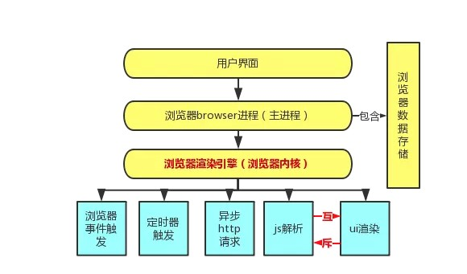
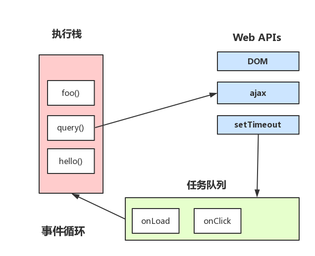

### 1 首先了解基本概念

进程：是计算机中的程序关于某数据集合上的一次运行活动，是系统进行资源分配和调度的基本单位，是[操作系统](https://baike.baidu.com/item/%E6%93%8D%E4%BD%9C%E7%B3%BB%E7%BB%9F)结构的基础；

线程：通常在一个进程中可以包含若干个[线程](https://baike.baidu.com/item/%E7%BA%BF%E7%A8%8B)，它们可以利用进程所拥有的资源，在引入[线程](https://baike.baidu.com/item/%E7%BA%BF%E7%A8%8B)的[操作系统](https://baike.baidu.com/item/%E6%93%8D%E4%BD%9C%E7%B3%BB%E7%BB%9F)中，通常都是把进程作为分配资源的基本单位，而把线程作为独立运行和独立调度的基本单位，由于[线程](https://baike.baidu.com/item/%E7%BA%BF%E7%A8%8B)比进程更小，基本上不拥有[系统资源](https://baike.baidu.com/item/%E7%B3%BB%E7%BB%9F%E8%B5%84%E6%BA%90)，故对它的调度所付出的开销就会小得多，能更高效的提高系统内多个程序间并发执行的程度。

**一个线程只能属于一个进程，而一个进程可以有多个线程，同一个进程之间的多个线程可以相互通信**

- `进程`是cpu资源分配的最小单位（是能拥有资源和独立运行的最小单位）
- `线程`是cpu调度的最小单位（线程是建立在进程的基础上的一次程序运行单位，一个进程中可以有多个线程）
- 不同`进程`之间也可以通信，不过代价较大
- `单线程`与`多线程`，都是指在一个`进程`内的单和多

浏览器是多进程的，浏览器之所以能够运行，是因为系统给浏览器分配了资源，这些资源包括电脑的 cpu  内存等；

浏览器是多进程的，每一个应用程序都会分别有很多的功能模块，这些功能模块实际上是通过`子进程`来实现的。 对于这种`子进程`的扩展方式，我们可以称这个应用程序是`多进程`的。

* Browser进程（主进程）
  * 协调控制其他子进程
  * 浏览器界面展示，用户交互，前进、后退、收藏
* GPU进程:用于3D绘制
* 浏览器的渲染进程（浏览器内核）

其中最重要的又是 浏览器的渲染引擎--渲染进程，这个进程又包括了多个线程：

* UI渲染线程 负责渲染浏览器界面，解析HTML，CSS，构建DOM树和RenderObject树，布局和绘制等。 当界面需要重绘（Repaint）或由于某种操作引发回流(reflow)时，该线程就会执行

`注意`:UI渲染线程与JS引擎线程是互斥的，当JS引擎执行时GUI线程会被挂起（相当于被冻结了），UI更新会被保存在一个队列中等到JS引擎空闲时立即被执行。

- js引擎线程（JS解析线程） 也称为JS内核，负责处理Javascript脚本程序。（例如V8引擎） JS引擎线程负责解析Javascript脚本，运行代码。 JS引擎一直等待着任务队列中任务的到来，然后加以处理，一个Tab页（renderer进程）中无论什么时候都__只有一个JS线程在运行JS程序__

`同样注意`:UI渲染线程与JS引擎线程是互斥的，所以如果JS执行的时间过长，这样就会造成页面的渲染不连贯，导致页面渲染加载阻塞。

- 事件触发线程 __归属于浏览器__而不是JS引擎，用来控制事件循环（可以理解，JS引擎自己都忙不过来，需要浏览器另开线程协助） 当JS引擎执行代码块如setTimeOut时（也可来自浏览器内核的其他线程,如鼠标点击、AJAX异步请求等），会将对应任务添加到事件线程中 当对应的事件符合触发条件被触发时，该线程会把事件添加到待处理队列的队尾，等待JS引擎的处理

`注意`：由于JS的单线程关系，所以这些待处理队列中的事件都得排队等待JS引擎处理（当JS引擎空闲时才会去执行）

- 定时触发器线程 传说中的setInterval与setTimeout所在线程 浏览器定时计数器并不是由JavaScript引擎计数的,（因为JavaScript引擎是单线程的, 如果处于阻塞线程状态就会影响记计时的准确） 因此通过单独线程来计时并触发定时（计时完毕后，添加到事件队列中，等待JS引擎空闲后执行）

`注意`:W3C在HTML标准中规定，规定要求setTimeout中低于4ms的时间间隔算为4ms。

- 异步http请求线程 在XMLHttpRequest在连接后是通过浏览器新开一个线程请求 将检测到状态变更时，如果设置有回调函数，异步线程就产生状态变更事件，将这个回调再放入事件队列中。再由JavaScript引擎执行。

### 2 从进程和线程看Event-Loop

首先看一张图

 **一个线程只能属于一个进程，而一个进程可以有多个线程，同一个进程之间的多个线程可以相互通信**

 首先，理解下我们常说的 **JS引擎是单线程的，JS任务分为同步任务和异步任务，同步任务会直接在主线程（js引擎线程）上执行，当JS引擎执行代码块如setTimeOut时（也可来自浏览器内核的其他线程,如鼠标点击、AJAX异步请求等），会将对应任务添加到事件线程中 当对应的事件符合触发条件被触发时，该线程会把事件添加到待处理队列的队尾，等待JS引擎的处理；当 JS 引擎空闲的时候，就会去读取任务队列，将可运行的异步任务添加到可执行栈中，开始执行；

对于异步任务，分为微任务和宏任务

- **微任务在宏任务之前的执行，先执行 执行栈中的内容 执行后 清空微任务**
- **每次取一个宏任务 就去清空微任务，之后再去取宏任务**

总结：

- 执行一个`宏任务`（栈中没有就从`事件队列`中获取）
- 执行过程中如果遇到`微任务`，就将它添加到`微任务`的任务队列中
- `宏任务`执行完毕后，立即执行当前`微任务队列`中的所有`微任务`（依次执行）
- 当前`宏任务`执行完毕，开始检查渲染，然后`GUI线程`接管渲染
- 渲染完毕后，`JS线程`继续接管，开始下一个`宏任务`（从事件队列中获取）

 

 