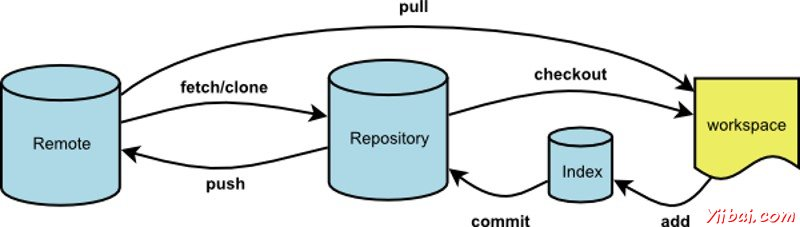

### 1 本地主机操作
1. 本地新建一个文件夹，此例是gitLearn文件夹初始化本地仓库 
2. git init ,此时这个文件夹就是被git管理的一个文件夹在gitLearn文件夹下添加一个文件 README.md,修改README.md的内容
3. git status 查看本地库的状态，git diff 查看本地工作区和暂存区的区别
4. 新建README.md文件 ,随便写点什么 : init 
5. git add 将本地文件添加，下次提交的时候会被提交到暂存区，git commit 将添加到暂存区的文件提交到暂存区，git status在此查看状态
6. git remote 查看远程仓库，由于此时还没有关联的远程仓库，所以此时执行命令并不会列出远程仓库

git branch -a

```
master
```

### 2 远程主机操作 

1. 添加远程仓库：git remote add origin git@github.com:jimwmg/learnGit.git(地址写自己的额git仓库名字
2. 添加远程仓库：git remote add open-cml  git@github.com:jimwmg/othergit_url.git(地址写自己的额git仓库名字
3. 在次查看远程仓库：git remote,此时该命令会列出远程仓库 git remote -r 列出远程分支  git remote -a 列出本地分支和远程分支
4. git push origin master:将本地的`master`分支推送到`origin`主机的`master`分支。如果`master`不存在，则会被新建。
5. 此时README.md就被添加到远程仓库，本地和远程的第一次实质性的交互完成了。

git branch -a

```
* master
//远程
remotes/origin/master
```

### 3 本地主机操作

1. 在master分支上 git branch test 在本地新建一个分支 test（此时test的分支就是以master分支的HEAD作为起点）

```
*master
test
remotes/origin/master
```

2. 在test分支上修改一些内容 README.md ，随便添加一些内容
3. git push origin test :表示将本地分支test推送到远程主机origin,如果远程主机没有test分支，那么该分支将会被新建
4. 此时打开github上之前新建的仓库，发现上面多了一个分支 test

git branch -a

```
*master
test
remotes/origin/master
remotes/origin/test
```

**以上远程仓库origin的分支都是通过git push origin master.   git push origin test  将本地分支master和test推送到远程主机（第一次推送的时候，因为远程主机并没有master和test分支，所以会在远程主机新建这两个分支）**

远程主机新建分支通过 **git push 实现**

### 4 远程主机操作

1. 在github上新建一个分支，分支取名为  remoteBranch1 和 remoteBranch2，此时是直接在远程主机新建分支，区分通过git push 的形式
2. git branch -a 

```
* master
test
//远程
remotes/origin/master
remotes/origin/test
```

此时发现，本地并没有  remotes/origin/remoteBranch 这个分支，也就是说本地并没有将远程主机的更新（新建分支）拉取下来，此时需要将远程主机的拉取下来；

所取回的更新，在本地主机上要用”远程主机名/分支名”的形式读取。

比如 git fetch origin remoteBranch1 , 就是将**远程主机**的remoteBranch分支取回到**本地主机**，然后在本地主机就可以通过**origin/remoteBranch1** 的形式访问,对于没有从**远程主机**取回的更新则无法在**本地主机**通过 origin/<分支名>的方式访问

**注意理解远程主机和本地主机的区别和联系**

```
git fetch 默认取回远程主机所有更新取回到本地主机
git fetch origin <分支名> 则仅仅将远程主机指定的分支取回到本地主机
```

3. git fetch origin remoteBranch1    git branch -a


```
* master
test
//远程
remotes/origin/master
remotes/origin/test
remotes/origin/remoteBranch1
```

* 先拉取，然后拣出到分支

```
git checkout -b remoteBranch1 origin/remoteBranch1 表示新建一个remoteBranch1,切换到该分支，然后拣出远程主机 origin/remoteBranch1 上的内容 （因为已经git fetch origin remoteBranch1 到本地，所以可以使用）
```

* 新建分支，然后拣出

```
git checkout -b remoteBranch2 origin/remoteBranch2 
//Cannot update paths and switch to branch 'remoteBranch3' at the same time.
所以应该先将远程的拉取下来
```

```
git checkout -b remoteBranch2.新建remoteBranch2分支，并且切换到该分支
git pull origin remoteBranch2 : remoteBranch2 (等价于git fetch 和 git merge)
```

相当于是从远程获取最新版本并`merge`到本地,上述命令其实相当于`git fetch` 和 `git merge`
在实际使用中，`git fetch`更安全一些，因为在`merge`前，我们可以查看更新情况，然后再决定是否合并。

4. git fetch (或者git fetch —all )

git branch -a

```
* master
test
//远程
remotes/origin/master
remotes/origin/test
remotes/origin/remoteBranch1 
remotes/origin/remoteBranch2
```





对于工作区  暂存区  版本库

如果我们在git仓库中新建一个文件`test.txt`,每次新建的文件都是 untracked状态(未跟踪)

```cmd
git status
On branch master
Your branch is up to date with 'origin/master'.

Untracked files:
  (use "git add <file>..." to include in what will be committed)

        test.txt

```

将工作区 untracked 的文件通过命令`git add .` 添加到暂存区，然后在通过 `git status` 查看状态

```cmd
git add .
git status
On branch master
Your branch is up to date with 'origin/master'.

Changes to be committed:
  (use "git reset HEAD <file>..." to unstage)

        new file:   test.txt
```

#### 如何恢复`git add`误添加到暂存区的文件

当我们将变动提交到了暂存区，如果是一些误提交到暂存区的文件，那么如何将其从暂存区踢出到工作区或者直接删除呢？

以下命令可以将错误提交到暂存区的文件恢复到工作区；

```
git rm --cache filename
```

如果工作区也不想要这个文件了，那么可以通过以下命令，执行之后，工作区和暂存区都没有这个文件了；

```
git rm -f filename 
```

#### 如何恢复`git commit`误提交到版本库的文件

也有很多时候我们会将变更直接 commit 到了版本库，那么此时需要用 `git reset`命令

错误提交到了版本库，此时无论工作区、暂存区，还是版本库，这三者的内容都是一样的 ，所以在这种情况下，只是删除了工作区和暂存区的文件，下一次用该版本库回滚那个误添加的文件还会重新生成。

这个时候，我们必须撤销版本库的修改才能解决问题！

git reset有三个选项，--hard、--mixed、--soft。

```sql
//仅仅只是撤销已提交的版本库，不会修改暂存区和工作区
git reset --soft 版本库ID

//仅仅只是撤销已提交的版本库和暂存区，不会修改工作区
git reset --mixed 版本库ID

//彻底将工作区、暂存区和版本库记录恢复到指定的版本库
git reset --hard 版本库ID
```

### .gitignore文件生效

```
git rm -r --cached .  #清除缓存
git add . #重新trace file
git commit -m "update .gitignore" #提交和注释
git push origin master #可选，如果需要同步到remote上的话

```

#### github -release修改：

[https://github.com/waylau/github-help/blob/master/Creating%20Releases%20%E5%88%9B%E5%BB%BA%E5%8F%91%E5%B8%83%E5%8C%85.md](https://github.com/waylau/github-help/blob/master/Creating Releases 创建发布包.md)

### 项目中如何同时管理多个子项目

方案一是通过.gitignore 忽略某个文件夹

方案二是通过submodule 

具体[参考](https://zhuanlan.zhihu.com/p/87053283)

[git官网文档]([https://git-scm.com/book/zh/v2/Git-%E5%B7%A5%E5%85%B7-%E5%AD%90%E6%A8%A1%E5%9D%97](https://git-scm.com/book/zh/v2/Git-工具-子模块))

### 自己学习git的一些测试

[常用命令集合](https://github.com/jimwmg/JiM-Blog/blob/master/JavaScript/%E6%9E%84%E5%BB%BA%E5%B7%A5%E5%85%B7/007git%E5%91%BD%E4%BB%A4%20.md)
[git 详细教程](https://www.yiibai.com/git/git_commit.html)
