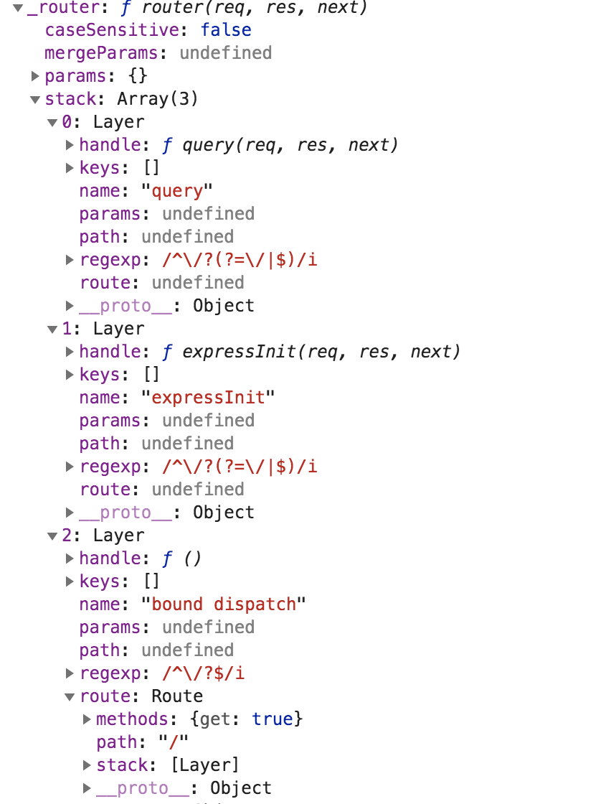

### 1 基本使用

```javascript
var express = require('express');
var app = express();

app.get('/', function (req, res) {
  res.send('Hello World');
});

app.listen(3000, function () {
  console.log('app is listening at port 3000');
});
```



接下来我们主要看下  `var app = express();`(createApplication)函数执行 这行代码主要会：

* 声明 `app` 变量
* 混入 `EventEmitter.prototype` 以及`application`
* 往app变量上挂载` request response`
* 执行 `init`函数
* 执行app.listen
### 2 源码分析

```javascript
var proto = require('./application');
var Route = require('./router/route');
var Router = require('./router');
var req = require('./request');
var res = require('./response');
var mixin = require('merge-descriptors');

exports = module.exports = createApplication;

function createApplication() {
  var app = function(req, res, next) {
    app.handle(req, res, next);
  };
//第三个参数传入 false 不会覆盖原有属性
  mixin(app, EventEmitter.prototype, false);
  mixin(app, proto, false);

  // expose the prototype that will get set on requests
  app.request = Object.create(req, {
    app: { configurable: true, enumerable: true, writable: true, value: app }
  })

  // expose the prototype that will get set on responses
  app.response = Object.create(res, {
    app: { configurable: true, enumerable: true, writable: true, value: app }
  })

  app.init();
  return app;
}

```
`merge-descriptors`
```javascript

//merge-descriptors 包的基本源码实现
var hasOwnProperty = Object.prototype.hasOwnProperty
function merge(dest,src,redefine){
  if(!dest){
    throw new TypeError('argument dest is required')
  }
  if(!src){
    throw new TypeError('argument src is required')
  }
  if(redefine === undefined){
    redefine = true;//如果没有传该参数，默认会覆盖dest上对应的key
  }
  //获取对象（array,object）自身所有可枚举与不可枚举的属性数组
  Object.getOwnPropertyNames(src).forEach((name) => {
    //如果传入了redefine 为falsy,并且dest上有对应的key值，则不会进行覆盖
    if(!redefine && hasOwnProperty.call(dest,name)){
      return 
    }
    //getOwnPropertyDescriptor 获取对象【自身】某个属性的描述
    var descriptor = Object.getOwnPropertyDescriptor(src,name);
    Object.defineProperty(dest,name,descriptor);
  });
  return dest;
}
```

```javascript
var proto = require('./application');
mixin(app, proto, false);
```

看下 proto 里面都有什么

```javascript

var app = exports = module.exports = {};
app.init = function(){}
app.defaultConfiguration = function(){}
app.lazyrouter = funciton(){}
app.handle = function(){}
app.use = function(){}
app.route = function(){}
app.engine = function(){}
app.param = function(){}
app.set = function(){}
app.path = function(){}
app.enabled = function(){}
app.disabled = function(){}
app.enable = function(){}
app.disable = function(){}
app.all = function(){}
app.del = function(){}
app.render = function(){}
app.listen = function(){}
//methods ==> http模块的 http.METHODS
methods.forEach((method) => {
  app[method] = function(){}
})


```

看下 `app.request  app.response` 主要有哪些内容

```javascript
var req = require('./request');
var res = require('./response');
app.request = Object.create(req, {
  app: { configurable: true, enumerable: true, writable: true, value: app }
})

// expose the prototype that will get set on responses
app.response = Object.create(res, {
  app: { configurable: true, enumerable: true, writable: true, value: app }
})
```

`request.js`

```javascript
var accepts = require('accepts');
var deprecate = require('depd')('express');
var isIP = require('net').isIP;
var typeis = require('type-is');
var http = require('http');
var fresh = require('fresh');
var parseRange = require('range-parser');
var parse = require('parseurl');
var proxyaddr = require('proxy-addr');

/**
 * Request prototype.
 * @public
 */
//http.IncomingMessage.prototype ==> <stream.Readable>
var req = Object.create(http.IncomingMessage.prototype)

/**
 * Module exports.
 * @public
 */

module.exports = req


req.get =
req.header = function header(name) {
  if (!name) {
    throw new TypeError('name argument is required to req.get');
  }

  if (typeof name !== 'string') {
    throw new TypeError('name must be a string to req.get');
  }

  var lc = name.toLowerCase();

  switch (lc) {
    case 'referer':
    case 'referrer':
      return this.headers.referrer
        || this.headers.referer;
    default:
      return this.headers[lc];
  }
};


req.accepts = function(){
  var accept = accepts(this);
  return accept.types.apply(accept, arguments);
};

/**
 * Check if the given `encoding`s are accepted.
 *
 * @param {String} ...encoding
 * @return {String|Array}
 * @public
 */

req.acceptsEncodings = function(){
  var accept = accepts(this);
  return accept.encodings.apply(accept, arguments);
};

req.acceptsEncoding = deprecate.function(req.acceptsEncodings,
  'req.acceptsEncoding: Use acceptsEncodings instead');

/**
 * Check if the given `charset`s are acceptable,
 * otherwise you should respond with 406 "Not Acceptable".
 *
 * @param {String} ...charset
 * @return {String|Array}
 * @public
 */

req.acceptsCharsets = function(){
  var accept = accepts(this);
  return accept.charsets.apply(accept, arguments);
};

req.acceptsCharset = deprecate.function(req.acceptsCharsets,
  'req.acceptsCharset: Use acceptsCharsets instead');

/**
 * Check if the given `lang`s are acceptable,
 * otherwise you should respond with 406 "Not Acceptable".
 *
 * @param {String} ...lang
 * @return {String|Array}
 * @public
 */

req.acceptsLanguages = function(){
  var accept = accepts(this);
  return accept.languages.apply(accept, arguments);
};

req.acceptsLanguage = deprecate.function(req.acceptsLanguages,
  'req.acceptsLanguage: Use acceptsLanguages instead');


req.range = function range(size, options) {
  var range = this.get('Range');
  if (!range) return;
  return parseRange(size, range, options);
};

/**
 * Return the value of param `name` when present or `defaultValue`.
 *
 *  - Checks route placeholders, ex: _/user/:id_
 *  - Checks body params, ex: id=12, {"id":12}
 *  - Checks query string params, ex: ?id=12
 *
 * To utilize request bodies, `req.body`
 * should be an object. This can be done by using
 * the `bodyParser()` middleware.
 *
 * @param {String} name
 * @param {Mixed} [defaultValue]
 * @return {String}
 * @public
 */

req.param = function param(name, defaultValue) {
  var params = this.params || {};
  var body = this.body || {};
  var query = this.query || {};

  var args = arguments.length === 1
    ? 'name'
    : 'name, default';
  deprecate('req.param(' + args + '): Use req.params, req.body, or req.query instead');

  if (null != params[name] && params.hasOwnProperty(name)) return params[name];
  if (null != body[name]) return body[name];
  if (null != query[name]) return query[name];

  return defaultValue;
};

/**
 * Check if the incoming request contains the "Content-Type"
 * header field, and it contains the give mime `type`.
 *
 * Examples:
 *
 *      // With Content-Type: text/html; charset=utf-8
 *      req.is('html');
 *      req.is('text/html');
 *      req.is('text/*');
 *      // => true
 *
 *      // When Content-Type is application/json
 *      req.is('json');
 *      req.is('application/json');
 *      req.is('application/*');
 *      // => true
 *
 *      req.is('html');
 *      // => false
 *
 * @param {String|Array} types...
 * @return {String|false|null}
 * @public
 */

req.is = function is(types) {
  var arr = types;

  // support flattened arguments
  if (!Array.isArray(types)) {
    arr = new Array(arguments.length);
    for (var i = 0; i < arr.length; i++) {
      arr[i] = arguments[i];
    }
  }

  return typeis(this, arr);
};

defineGetter(req, 'protocol', function protocol(){
  var proto = this.connection.encrypted
    ? 'https'
    : 'http';
  var trust = this.app.get('trust proxy fn');

  if (!trust(this.connection.remoteAddress, 0)) {
    return proto;
  }

  // Note: X-Forwarded-Proto is normally only ever a
  //       single value, but this is to be safe.
  var header = this.get('X-Forwarded-Proto') || proto
  var index = header.indexOf(',')

  return index !== -1
    ? header.substring(0, index).trim()
    : header.trim()
});

defineGetter(req, 'secure', function secure(){
  return this.protocol === 'https';
});


defineGetter(req, 'ip', function ip(){
  var trust = this.app.get('trust proxy fn');
  return proxyaddr(this, trust);
});

defineGetter(req, 'ips', function ips() {
  var trust = this.app.get('trust proxy fn');
  var addrs = proxyaddr.all(this, trust);

  // reverse the order (to farthest -> closest)
  // and remove socket address
  addrs.reverse().pop()

  return addrs
});

defineGetter(req, 'subdomains', function subdomains() {
  var hostname = this.hostname;

  if (!hostname) return [];

  var offset = this.app.get('subdomain offset');
  var subdomains = !isIP(hostname)
    ? hostname.split('.').reverse()
    : [hostname];

  return subdomains.slice(offset);
});


defineGetter(req, 'path', function path() {
  return parse(this).pathname;
});


defineGetter(req, 'hostname', function hostname(){
  var trust = this.app.get('trust proxy fn');
  var host = this.get('X-Forwarded-Host');

  if (!host || !trust(this.connection.remoteAddress, 0)) {
    host = this.get('Host');
  } else if (host.indexOf(',') !== -1) {
    // Note: X-Forwarded-Host is normally only ever a
    //       single value, but this is to be safe.
    host = host.substring(0, host.indexOf(',')).trimRight()
  }

  if (!host) return;

  // IPv6 literal support
  var offset = host[0] === '['
    ? host.indexOf(']') + 1
    : 0;
  var index = host.indexOf(':', offset);

  return index !== -1
    ? host.substring(0, index)
    : host;
});

// TODO: change req.host to return host in next major

defineGetter(req, 'host', deprecate.function(function host(){
  return this.hostname;
}, 'req.host: Use req.hostname instead'));


defineGetter(req, 'fresh', function(){
  var method = this.method;
  var res = this.res
  var status = res.statusCode

  // GET or HEAD for weak freshness validation only
  if ('GET' !== method && 'HEAD' !== method) return false;

  // 2xx or 304 as per rfc2616 14.26
  if ((status >= 200 && status < 300) || 304 === status) {
    return fresh(this.headers, {
      'etag': res.get('ETag'),
      'last-modified': res.get('Last-Modified')
    })
  }

  return false;
});


defineGetter(req, 'stale', function stale(){
  return !this.fresh;
});


defineGetter(req, 'xhr', function xhr(){
  var val = this.get('X-Requested-With') || '';
  return val.toLowerCase() === 'xmlhttprequest';
});


function defineGetter(obj, name, getter) {
  Object.defineProperty(obj, name, {
    configurable: true,
    enumerable: true,
    get: getter
  });
}

```
我们从 `app.init()` 开始

```javascript
app.init = function(){
  this.cache = {}
  this.engines = {}
  this.settings = {}
  this.defautlConfigration()
}
```
`app.defaultConfigration()` : 向`this.settings`中增加默认设置
```javascript
app.defaultConfiguration = function defaultConfiguration() {
  var env = process.env.NODE_ENV || 'development';

  // default settings
  this.enable('x-powered-by');
  /*
  app.enable = function enable(setting) {
    return this.set(setting, true);
  };
  */
  this.set('etag', 'weak');
  /*
  app.set = function set(setting, val) {
    if (arguments.length === 1) {
      // app.get(setting)
      return this.settings[setting];
    }

    debug('set "%s" to %o', setting, val);

    // set value
    this.settings[setting] = val;

    // trigger matched settings
    switch (setting) {
      case 'etag':
        this.set('etag fn', compileETag(val));
        break;
      case 'query parser':
        this.set('query parser fn', compileQueryParser(val));
        break;
      case 'trust proxy':
        this.set('trust proxy fn', compileTrust(val));

        // trust proxy inherit back-compat
        Object.defineProperty(this.settings, trustProxyDefaultSymbol, {
          configurable: true,
          value: false
        });

        break;
    }

    return this;
  };
  */
  this.set('env', env);
  this.set('query parser', 'extended');
  this.set('subdomain offset', 2);
  this.set('trust proxy', false);

  // trust proxy inherit back-compat
  Object.defineProperty(this.settings, trustProxyDefaultSymbol, {
    configurable: true,
    value: true
  });

  debug('booting in %s mode', env);

  this.on('mount', function onmount(parent) {
    // inherit trust proxy
    if (this.settings[trustProxyDefaultSymbol] === true
      && typeof parent.settings['trust proxy fn'] === 'function') {
      delete this.settings['trust proxy'];
      delete this.settings['trust proxy fn'];
    }

    // inherit protos
    setPrototypeOf(this.request, parent.request)
    setPrototypeOf(this.response, parent.response)
    setPrototypeOf(this.engines, parent.engines)
    setPrototypeOf(this.settings, parent.settings)
  });

  // setup locals
  this.locals = Object.create(null);

  // top-most app is mounted at /
  this.mountpath = '/';

  // default locals
  this.locals.settings = this.settings;

  // default configuration
  this.set('view', View);
  this.set('views', resolve('views'));
  this.set('jsonp callback name', 'callback');

  if (env === 'production') {
    this.enable('view cache');
  }

  Object.defineProperty(this, 'router', {
    get: function() {
      throw new Error('\'app.router\' is deprecated!\nPlease see the 3.x to 4.x migration guide for details on how to update your app.');
    }
  });
};
```

执行 app.get 注册路由

```javascript
app.get('/', function (req, res) {
  res.send('Hello World');
});
```

```javascript
methods.forEach(function(method){
  app[method] = function(path){
    if (method === 'get' && arguments.length === 1) {
      // app.get(setting)
      return this.set(path);
    }

    this.lazyrouter();

    var route = this._router.route(path);
    route[method].apply(route, slice.call(arguments, 1));
    return this;
  };
});
```

执行`this.lazyrouter();`

```javascript
app.lazyrouter = function lazyrouter() {
  if (!this._router) {
    this._router = new Router({
      caseSensitive: this.enabled('case sensitive routing'),
      strict: this.enabled('strict routing')
    });
		//对比文章开头图片中的 _router.stack 数组中的前两个值
    this._router.use(query(this.get('query parser fn')));
    this._router.use(middleware.init(this)); //
  }
};
```

`app.lazyrouter` 在 app 上挂载 `_router`对象，然后向 `this._router.stack` 中 push `middleware.init(this)`,该middleware返回的函数用于增强 req res；

```javascript
var proto = module.exports = function(options) {
  var opts = options || {};

  function router(req, res, next) {
    router.handle(req, res, next);
  }

  // mixin Router class functions  router.__proto__ = proto
  setPrototypeOf(router, proto)

  router.params = {};
  router._params = [];
  router.caseSensitive = opts.caseSensitive;
  router.mergeParams = opts.mergeParams;
  router.strict = opts.strict;
  router.stack = [];

  return router;
};
```

```java
//middleware.init 
exports.init = function(app){
  return function expressInit(req, res, next){
    if (app.enabled('x-powered-by')) res.setHeader('X-Powered-By', 'Express');
    req.res = res;
    res.req = req;
    req.next = next;
    /*
    req.__proto__ = app.request;
    res.__proto__ = app.response;
    */
    setPrototypeOf(req, app.request)
    setPrototypeOf(res, app.response)

    res.locals = res.locals || Object.create(null);

    next();
  };
};

```

执行`var route = this._router.route(path);`

```javascript
proto.route = function route(path) {
  var route = new Route(path);

  var layer = new Layer(path, {
    sensitive: this.caseSensitive,
    strict: this.strict,
    end: true
  }, route.dispatch.bind(route));

  layer.route = route;
	////对比文章开头图片中的 _router.stack 数组中最后一个值
  this.stack.push(layer);
  return route;
};
```

`route.dispatch.bind(route)`

```java
Route.prototype.dispatch = function dispatch(req, res, done) {
  var idx = 0;
  var stack = this.stack;
  if (stack.length === 0) {
    return done();
  }

  var method = req.method.toLowerCase();
  if (method === 'head' && !this.methods['head']) {
    method = 'get';
  }

  req.route = this;

  next();

  function next(err) {
    // signal to exit route
    if (err && err === 'route') {
      return done();
    }

    // signal to exit router
    if (err && err === 'router') {
      return done(err)
    }

    var layer = stack[idx++];
    if (!layer) {
      return done(err);
    }

    if (layer.method && layer.method !== method) {
      return next(err);
    }

    if (err) {
      layer.handle_error(err, req, res, next);
    } else {
      layer.handle_request(req, res, next);
    }
  }
};
```

执行` route[method].apply(route, slice.call(arguments, 1));`

```javascript
function Route(path) {
  this.path = path;
  this.stack = [];

  debug('new %o', path)

  // route handlers for various http methods
  this.methods = {};
}
methods.forEach(function(method){
  Route.prototype[method] = function(){
    var handles = flatten(slice.call(arguments));

    for (var i = 0; i < handles.length; i++) {
      var handle = handles[i];

      if (typeof handle !== 'function') {
        var type = toString.call(handle);
        var msg = 'Route.' + method + '() requires a callback function but got a ' + type
        throw new Error(msg);
      }

      debug('%s %o', method, this.path)

      var layer = Layer('/', {}, handle);
      layer.method = method;

      this.methods[method] = true;
      //对比文章开头图片中的 _router.stack 数组中的前最后一个值的 _router.stack[2].route.stack
      this.stack.push(layer);
    }

    return this;
  };
});
```


执行`app.listen`

```javascript
app.listen = function listen() {
  var server = http.createServer(this);//这个this指的是 
  /*
  var app = function(req, res, next) {
    app.handle(req, res, next);
  };
  */
  return server.listen.apply(server, arguments);
};
```

```javascript
app.handle = function handle(req, res, callback) {
  var router = this._router;//这个在app.get中进行的注册

  // final handler
  var done = callback || finalhandler(req, res, {
    env: this.get('env'),
    onerror: logerror.bind(this)
  });

  // no routes
  if (!router) {
    debug('no routes defined on app');
    done();
    return;
  }

  router.handle(req, res, done);
  /* router.handle 这里将http原生的 req res 传入
  if (layerError) {
      layer.handle_error(layerError, req, res, next);
    } else {
      layer.handle_request(req, res, next);
    }
  */
};
```

