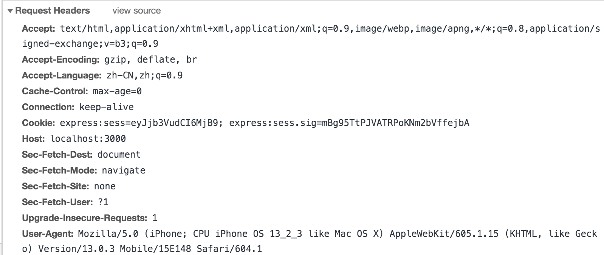
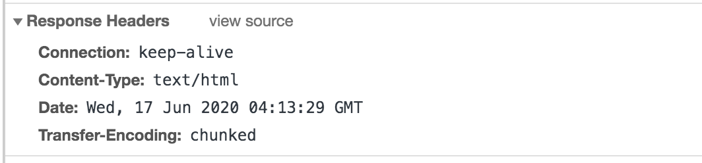
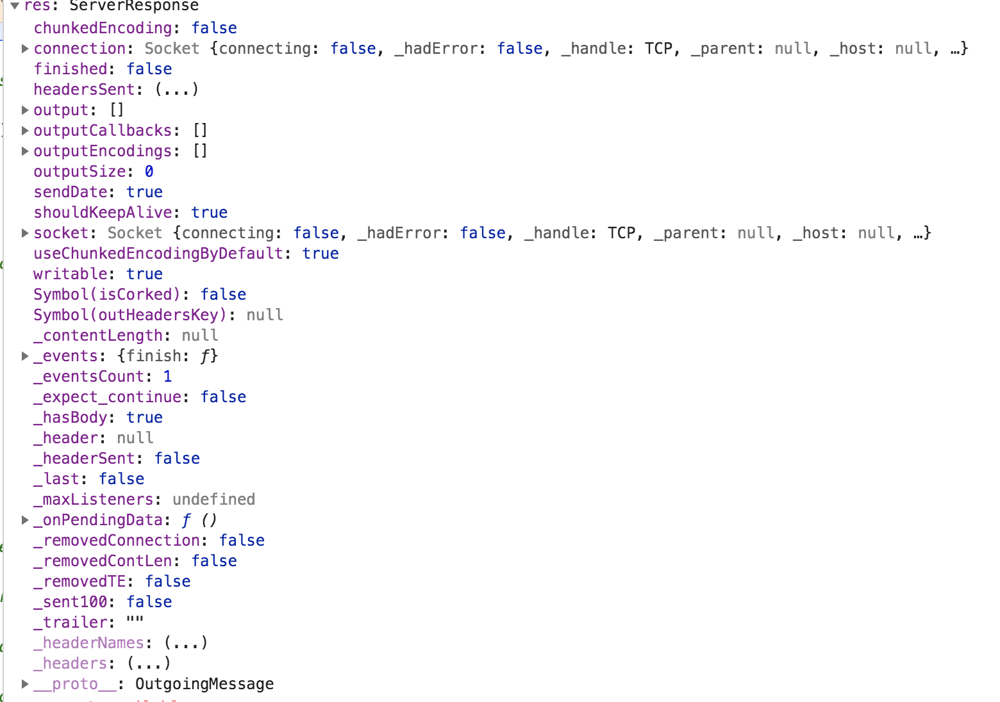

---
title:NodeJS-HTTP-req-res类
---

### 1.HTTP服务

```javascript
var accepts = require('accepts')
var http = require('http')
 
function app (req, res) {
  var accept = accepts(req)
  debugger;
  console.log(req)
  console.log(accept.type)
  // the order of this list is significant; should be server preferred order
  switch (accept.type(['json', 'html'])) {
    case 'json':
      res.setHeader('Content-Type', 'application/json')
      res.write('{"hello":"world!"}')
      break
    case 'html':
      res.setHeader('Content-Type', 'text/html')
      res.write('<b>hello, world!</b>')
      break
    default:
      // the fallback is text/plain, so no need to specify it above
      res.setHeader('Content-Type', 'text/plain')
      res.write('hello, world!')
      break
  }
 
  res.end()
}
 
http.createServer(app).listen(3000)

```

### 2.req 参数具体属性

`IncomingMessage` 对象由 [`http.Server`](http://nodejs.cn/s/jLiRTh) 或 [`http.ClientRequest`](http://nodejs.cn/s/2F5RHd) 创建，并分别作为第一个参数传给 [`'request'`](http://nodejs.cn/s/2qCn57) 和 [`'response'`](http://nodejs.cn/s/qwaiK8) 事件。

 

它可用于访问【响应状态】、【消息头】、【以及数据】


[http-IncomingMessage 类](http://nodejs.cn/api/http.html#http_class_http_incomingmessage)

### 3.res 参数具体属性

此对象由 HTTP 服务器在内部创建，而不是由用户创建。 它会作为第二个参数传给 [`'request'`](http://nodejs.cn/s/2qCn57) 事件。






[http_serverresponse](http://nodejs.cn/api/http.html#http_class_http_serverresponse)

### 4.accepts 模块

```
/*
var accepts = require('accepts')
accepts(req)
Create a new Accepts object for the given req.

.charset(charsets)
Return the first accepted charset. If nothing in charsets is accepted, then false is returned.

.charsets()
Return the charsets that the request accepts, in the order of the client's preference (most preferred first).

.encoding(encodings)
Return the first accepted encoding. If nothing in encodings is accepted, then false is returned.

.encodings()
Return the encodings that the request accepts, in the order of the client's preference (most preferred first).

.language(languages)
Return the first accepted language. If nothing in languages is accepted, then false is returned.

.languages()
Return the languages that the request accepts, in the order of the client's preference (most preferred first).

.type(types)
Return the first accepted type (and it is returned as the same text as what appears in the types array). If nothing in types is accepted, then false is returned.

The types array can contain full MIME types or file extensions. Any value that is not a full MIME types is passed to require('mime-types').lookup.

.types()
Return the types that the request accepts, in the order of the client's preference (most preferred first).
*/
```

