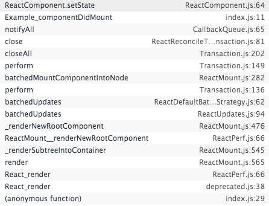

### 1 还是先声明一个组件，从最开始一步步来寻源；

```javascript
class App extends Component {
    //只在组件重新加载的时候执行一次
    constructor(props) {
        super(props);
      //..
    }
  	//other methods
}
//ReactBaseClasses.js中如下：这里就是setState函数的来源；
//super其实就是下面这个函数
function ReactComponent(props, context, updater) {
  this.props = props;
  this.context = context;
  this.refs = emptyObject;
  // We initialize the default updater but the real one gets injected by the
  // renderer.
  this.updater = updater || ReactNoopUpdateQueue;
}
ReactComponent.prototype.setState = function (partialState, callback) {
  this.updater.enqueueSetState(this, partialState);
  if (callback) {
    this.updater.enqueueCallback(this, callback, 'setState');
  }
};
```

所以主要来看是否传入了updater参数，也就是说何时进行 new  组件；具体的updater参数是怎么传递进来的，以及是那个对象，参见

[react源码分析系列文章](https://github.com/jimwmg/JiM-Blog/tree/master/React)下面的react中context   updater到底是如何传递的;以及事务处理过程；

这里直接说结果，updater对象其实就是ReactUpdateQueue.js 中暴漏出的ReactUpdateQueue对象；

###2 既然找到了setState之后执行的动作，我们在一步步深入进去

```jsx
class Root extends React.Component {
  constructor(props) {
    super(props);
    this.state = {
      val: 0
    };
  };
  click (){
    debugger;
    this.setState(val:100);
  };
  componentDidMount() {
    debugger;
    this.setState({val: this.state.val + 1});
    console.log(this.state.val);    // 第 1 次 log 0

    this.setState({val: this.state.val + 1});
    console.log(this.state.val);    // 第 2 次 log 0
    setTimeout(() => {
      debugger;
      this.setState({val: this.state.val + 1});
      console.log(this.state.val);  // 第 3 次 log 2

      this.setState({val: this.state.val + 1});
      console.log(this.state.val);  // 第 4 次 log 3
    }, 0);

  }
  render() {
    return (
      <div>
      	<div onClick ={ this.click.bind(this)}>点击</div>
                <div>{this.state.val}</div>
      </div>
    )
  }
}
```




```javascript
ReactComponent.prototype.setState = function (partialState, callback) {
  this.updater.enqueueSetState(this, partialState);
  if (callback) {
    this.updater.enqueueCallback(this, callback, 'setState');
  }
};
```

ReactUpdateQueue.js

```javascript
var ReactUpdates = require('./ReactUpdates');

function enqueueUpdate(internalInstance) {
  ReactUpdates.enqueueUpdate(internalInstance);
};
function getInternalInstanceReadyForUpdate(publicInstance, callerName) {
  //在ReactCompositeComponent.js中有这样一行代码，这就是其来源；
  // Store a reference from the instance back to the internal representation
    //ReactInstanceMap.set(inst, this);
  var internalInstance = ReactInstanceMap.get(publicInstance);
  //返回的是在ReactCompositeComponent.js中construct函数返回的对象；ReactInstance实例对象并不是简单的new 我们写的组件的实例对象，而是经过instantiateReactComponent.js中ReactCompositeComponentWrapper函数包装的对象；详见  创建React组件方式以及源码分析.md
  return internalInstance;
};
var ReactUpdateQueue = {
//。。。。省略其他代码
  enqueueCallback: function (publicInstance, callback, callerName) {
    ReactUpdateQueue.validateCallback(callback, callerName);
    var internalInstance = getInternalInstanceReadyForUpdate(publicInstance);
    if (!internalInstance) {
      return null;
    }
//这里将callback放入组件实例的_pendingCallbacks数组中；
    if (internalInstance._pendingCallbacks) {
      internalInstance._pendingCallbacks.push(callback);
    } else {
      internalInstance._pendingCallbacks = [callback];
    }
    // TODO: The callback here is ignored when setState is called from
    // componentWillMount. Either fix it or disallow doing so completely in
    // favor of getInitialState. Alternatively, we can disallow
    // componentWillMount during server-side rendering.
    enqueueUpdate(internalInstance);
  },

  enqueueSetState: function (publicInstance, partialState) {
    var internalInstance = getInternalInstanceReadyForUpdate(publicInstance, 'setState');
    if (!internalInstance) {
      return;
    }
    //这里，初始化queue变量，同时初始化 internalInstance._pendingStateQueue = [ ] ;
    //对于 || 的短路运算还是要多梳理下
    //queue数组（模拟队列）中存放着setState放进来的对象；
    var queue = internalInstance._pendingStateQueue || (internalInstance._pendingStateQueue = []);
    //这里将partialState放入queue数组中，也就是internalInstance._pendingStateQueue 数组中，此时，每次setState的partialState,都放进了React组件实例对象上的_pendingStateQueue属性中，成为一个数组；
    queue.push(partialState);

    enqueueUpdate(internalInstance);
  },
};

module.exports = ReactUpdateQueue;
```

可以看到enqueueSetState   enqueueCallback 最后都会执行enqueueUpdate；

```
function enqueueUpdate(internalInstance) {
  ReactUpdates.enqueueUpdate(internalInstance);
}
```

ReactUpdates.js

```javascript
var dirtyComponents = [];
var updateBatchNumber = 0;
var asapCallbackQueue = CallbackQueue.getPooled();
var asapEnqueued = false;
//这里声明batchingStrategy为null,后期通过注册给其赋值；
var batchingStrategy = null;
//这里的component参数是js中ReactCompositeComponentWrapper函数包装的后的React组件实例对象；
function enqueueUpdate(component) {
  ensureInjected();
//第一次执行setState的时候，可以进入if语句，遇到里面的return语句，终止执行
  //如果不是正处于创建或更新组件阶段,则处理update事务

  if (!batchingStrategy.isBatchingUpdates) {
    //batchedUpdates就是ReactDefaultBatchingStrategy.js中声明的
    batchingStrategy.batchedUpdates(enqueueUpdate, component);
    return;
  }
//第二次执行setState的时候，进入不了if语句，将组件放入dirtyComponents
  //如果正在创建或更新组件,则暂且先不处理update,只是将组件放在dirtyComponents数组中

  dirtyComponents.push(component);
  if (component._updateBatchNumber == null) {
    component._updateBatchNumber = updateBatchNumber + 1;
  }
};
//enqueueUpdate包含了React避免重复render的逻辑。mountComponent和updateComponent方法在执行的最开始，会调用到batchedUpdates进行批处理更新，此时会将isBatchingUpdates设置为true，也就是将状态标记为现在正处于更新阶段了。之后React以事务的方式处理组件update，事务处理完后会调用wrapper.close(), 而TRANSACTION_WRAPPERS中包含了RESET_BATCHED_UPDATES这个wrapper，故最终会调用RESET_BATCHED_UPDATES.close(), 它最终会将isBatchingUpdates设置为false。

```

ReactDefaultBatchingStrategy.js（如何注册的可以看下https://github.com/jimwmg/JiM-Blog/tree/master/React系列文章，React中context和updater是如何传递的 和 React中的注册机制）

ReactDefaultBatchingStrategy.js

```javascript
//RESET_BATCHED_UPDATES用来管理isBatchingUpdates的状态
var RESET_BATCHED_UPDATES = {
  initialize: emptyFunction,
  close: function () {
    // 事务批更新处理结束时，将isBatchingUpdates设为了false
    ReactDefaultBatchingStrategy.isBatchingUpdates = false;
  }
};
//FLUSH_BATCHED_UPDATES会在一个transaction的close阶段运行runBatchedUpdates，从而执行update。
//因为close的执行顺序是FLUSH_BATCHED_UPDATES.close ==> 然后RESET_BATCHED_UPDATES.close
var FLUSH_BATCHED_UPDATES = {
  initialize: emptyFunction,
  close: ReactUpdates.flushBatchedUpdates.bind(ReactUpdates)
};

var TRANSACTION_WRAPPERS = [FLUSH_BATCHED_UPDATES, RESET_BATCHED_UPDATES];

function ReactDefaultBatchingStrategyTransaction() {
  this.reinitializeTransaction();
}

_assign(ReactDefaultBatchingStrategyTransaction.prototype, Transaction, {
  getTransactionWrappers: function () {
    return TRANSACTION_WRAPPERS;
  }
});
//这个transition就是下面ReactDefaultBatchingStrategy对象中使用的transaction变量
var transaction = new ReactDefaultBatchingStrategyTransaction();
var ReactDefaultBatchingStrategy = {
  isBatchingUpdates: false,

  /**
   * Call the provided function in a context within which calls to `setState`
   * and friends are batched such that components aren't updated unnecessarily.
   */
  batchedUpdates: function (callback, a, b, c, d, e) {
    var alreadyBatchingUpdates = ReactDefaultBatchingStrategy.isBatchingUpdates;
// 批处理最开始时，将isBatchingUpdates设为true，表明正在更新
    //这里结合上面的图片可以看出，如果是在compponentDidMount中调用setState,其本身就是一景处于一个大的transition中了，此时的ReactDefaultBatchingStrategy.isBatchingUpdates被设置为true；当执行到componentDidMount中的setState的时候；看上面的ReactUpdates.js，执行enqueueUpdate的时候；不会在进入batchedUpdates，而是直接将其放入dirtyComponents；
    //这也就解释了为什么在componentDidMount中执行setState不会更新立即更新state的原因；
    ReactDefaultBatchingStrategy.isBatchingUpdates = true;

    // The code is written this way to avoid extra allocations
    if (alreadyBatchingUpdates) {
      return callback(a, b, c, d, e);
    } else {
      //transition在上面已经声明； // 以事务的方式处理updates，后面详细分析transaction
      return transaction.perform(callback, null, a, b, c, d, e);
    }
  }
};

module.exports = ReactDefaultBatchingStrategy;
```

接下来我们看下React中的事物处理机制到底是如何运行的；

Transaction.js

```javascript
var _prodInvariant = require('./reactProdInvariant');
var invariant = require('fbjs/lib/invariant');
var OBSERVED_ERROR = {};
var TransactionImpl = {
  reinitializeTransaction: function () {
    //getTransactionWrappers这个函数ReactDefaultBatchingStrategy.js中声明的，上面有；返回一个数组；
    this.transactionWrappers = this.getTransactionWrappers();
    if (this.wrapperInitData) {
      this.wrapperInitData.length = 0;
    } else {
      this.wrapperInitData = [];
    }
    this._isInTransaction = false;
  },

  _isInTransaction: false,
  getTransactionWrappers: null,
  isInTransaction: function () {
    return !!this._isInTransaction;
  },
  perform: function (method, scope, a, b, c, d, e, f) {
    var errorThrown;
    var ret;
    try {
      this._isInTransaction = true;
      errorThrown = true;
      //var TRANSACTION_WRAPPERS = [FLUSH_BATCHED_UPDATES, RESET_BATCHED_UPDATES];
      //1 这里会先执行所有的TRANSACTION_WRAPPERS中成员的initialize方法，上面声明的其都是emptyFunction
      this.initializeAll(0);
      //2 这里其实还是执行的 enqueueUpdate 函数
      ret = method.call(scope, a, b, c, d, e, f);
      errorThrown = false;
    } finally {
      try {
        if (errorThrown) {
          // If `method` throws, prefer to show that stack trace over any thrown
          // by invoking `closeAll`.
          try {
            this.closeAll(0);
          } catch (err) {}
        } else {
          // Since `method` didn't throw, we don't want to silence the exception
          // here.
          //3 执行TRANSACTION_WRAPPERS对象中成员的所有close方法；
          this.closeAll(0);
        }
      } finally {
        this._isInTransaction = false;
      }
    }
    return ret;
  },

  initializeAll: function (startIndex) {
    var transactionWrappers = this.transactionWrappers;
    for (var i = startIndex; i < transactionWrappers.length; i++) {
      var wrapper = transactionWrappers[i];
      try {
        
        this.wrapperInitData[i] = OBSERVED_ERROR;
        this.wrapperInitData[i] = wrapper.initialize ? wrapper.initialize.call(this) : null;
      } finally {
        if (this.wrapperInitData[i] === OBSERVED_ERROR) {
         
          try {
            this.initializeAll(i + 1);
          } catch (err) {}
        }
      }
    }
  },
  closeAll: function (startIndex) {
    var transactionWrappers = this.transactionWrappers;
    for (var i = startIndex; i < transactionWrappers.length; i++) {
      var wrapper = transactionWrappers[i];
      var initData = this.wrapperInitData[i];
      var errorThrown;
      try {
   
        errorThrown = true;
        if (initData !== OBSERVED_ERROR && wrapper.close) {
          wrapper.close.call(this, initData);
        }
        errorThrown = false;
      } finally {
        if (errorThrown) {
        
          try {
            this.closeAll(i + 1);
          } catch (e) {}
        }
      }
    }
    this.wrapperInitData.length = 0;
  }
};

module.exports = TransactionImpl
```

```javascript
//3 执行TRANSACTION_WRAPPERS对象中成员的所有close方法；
var FLUSH_BATCHED_UPDATES = {
  initialize: emptyFunction,
  close: ReactUpdates.flushBatchedUpdates.bind(ReactUpdates)
};
```

接着会执行ReactUpdates.js中的flushBatchedUpdates方法

ReactUpdates.js中

```javascript
//注意区分和ReactDefaultBatchingStrategy.js中的transition;
var NESTED_UPDATES = {
  initialize: function () {
    this.dirtyComponentsLength = dirtyComponents.length;
  },
  close: function () {
    if (this.dirtyComponentsLength !== dirtyComponents.length) {
      // Additional updates were enqueued by componentDidUpdate handlers or
      // similar; before our own UPDATE_QUEUEING wrapper closes, we want to run
      // these new updates so that if A's componentDidUpdate calls setState on
      // B, B will update before the callback A's updater provided when calling
      // setState.
      dirtyComponents.splice(0, this.dirtyComponentsLength);
      flushBatchedUpdates();
    } else {
      dirtyComponents.length = 0;
    }
  }
};

var UPDATE_QUEUEING = {
  initialize: function () {
    this.callbackQueue.reset();
  },
  close: function () {
    this.callbackQueue.notifyAll();
  }
};

var TRANSACTION_WRAPPERS = [NESTED_UPDATES, UPDATE_QUEUEING];

function ReactUpdatesFlushTransaction() {
  this.reinitializeTransaction();
  this.dirtyComponentsLength = null;
  this.callbackQueue = CallbackQueue.getPooled();
  this.reconcileTransaction = ReactUpdates.ReactReconcileTransaction.getPooled(
  /* useCreateElement */true);
}

_assign(ReactUpdatesFlushTransaction.prototype, Transaction, {
  getTransactionWrappers: function () {
    return TRANSACTION_WRAPPERS;
  },

  destructor: function () {
    this.dirtyComponentsLength = null;
    CallbackQueue.release(this.callbackQueue);
    this.callbackQueue = null;
    ReactUpdates.ReactReconcileTransaction.release(this.reconcileTransaction);
    this.reconcileTransaction = null;
  },

  perform: function (method, scope, a) {
    // Essentially calls `this.reconcileTransaction.perform(method, scope, a)`
    // with this transaction's wrappers around it.
    return Transaction.perform.call(this, this.reconcileTransaction.perform, this.reconcileTransaction, method, scope, a);
  }
});
var flushBatchedUpdates = function () {
 
  while (dirtyComponents.length || asapEnqueued) {
    if (dirtyComponents.length) {
      //这个transition是ReactUpdates.js中声明的，注意区分
      var transaction = ReactUpdatesFlushTransaction.getPooled();
      //这里执行runBatchedUpdates函数；perform就是上面声明的perform函数，该函数又会进入Transition.js中的perform函数；
      transaction.perform(runBatchedUpdates, null, transaction);
      ReactUpdatesFlushTransaction.release(transaction);
    }

    if (asapEnqueued) {
      asapEnqueued = false;
      var queue = asapCallbackQueue;
      asapCallbackQueue = CallbackQueue.getPooled();
      queue.notifyAll();
      CallbackQueue.release(queue);
    }
  }
};
function runBatchedUpdates(transaction) {
  var len = transaction.dirtyComponentsLength;
 
  dirtyComponents.sort(mountOrderComparator);

  updateBatchNumber++;

  for (var i = 0; i < len; i++) {
 
    var component = dirtyComponents[i];
    var callbacks = component._pendingCallbacks;
    component._pendingCallbacks = null;

    var markerName;
    if (ReactFeatureFlags.logTopLevelRenders) {
      var namedComponent = component;
      // Duck type TopLevelWrapper. This is probably always true.
      if (component._currentElement.type.isReactTopLevelWrapper) {
        namedComponent = component._renderedComponent;
      }
      markerName = 'React update: ' + namedComponent.getName();
      console.time(markerName);
    }
//这里才是真正的开始更新组件
    ReactReconciler.performUpdateIfNecessary(component, transaction.reconcileTransaction, updateBatchNumber);

    if (markerName) {
      console.timeEnd(markerName);
    }

    if (callbacks) {
      for (var j = 0; j < callbacks.length; j++) {
        transaction.callbackQueue.enqueue(callbacks[j], component.getPublicInstance());
      }
    }
  }
}


```

ReactReconciler.js中

```javascript
performUpdateIfNecessary: function (internalInstance, transaction, updateBatchNumber) {
    if (internalInstance._updateBatchNumber !== updateBatchNumber) {
      // The component's enqueued batch number should always be the current
      // batch or the following one.
      return;
    }
  //这里执行React组件实例对象的更新；internalInstance上的performUpdateIfNecessary在ReactCompositeComponent.js中的；
    internalInstance.performUpdateIfNecessary(transaction);
    if (process.env.NODE_ENV !== 'production') {
      if (internalInstance._debugID !== 0) {
        ReactInstrumentation.debugTool.onUpdateComponent(internalInstance._debugID);
      }
    }
  }
```

ReactCompositeComponent.js

顺便提下React声明周期中

- #### Updating

  An update can be caused by changes to props or state. These methods are called when a component is being re-rendered:

  - [`componentWillReceiveProps()`](https://reactjs.org/docs/react-component.html#componentwillreceiveprops)
  - [`shouldComponentUpdate()`](https://reactjs.org/docs/react-component.html#shouldcomponentupdate)
  - [`componentWillUpdate()`](https://reactjs.org/docs/react-component.html#componentwillupdate)
  - [`render()`](https://reactjs.org/docs/react-component.html#render)
  - [`componentDidUpdate()`](https://reactjs.org/docs/react-component.html#componentdidupdate)

  #### Unmounting

  This method is called when a component is being removed from the DOM:

  - [`componentWillUnmount()`](https://reactjs.org/docs/react-component.html#componentwillunmount)

```javascript
performUpdateIfNecessary: function (transaction) {
  if (this._pendingElement != null) {
    // receiveComponent会最终调用到updateComponent，从而刷新View
    ReactReconciler.receiveComponent(this, this._pendingElement, transaction, this._context);
  } else if (this._pendingStateQueue !== null || this._pendingForceUpdate) {
    // 执行updateComponent，从而刷新View。
    this.updateComponent(transaction, this._currentElement, this._currentElement, this._context, this._context);
  } else {
    this._updateBatchNumber = null;
  }
},

  //执行更新React组件的props. state。context函数
  updateComponent: function (transaction, prevParentElement, nextParentElement, prevUnmaskedContext, nextUnmaskedContext) {
    var inst = this._instance;
    var willReceive = false;
    var nextContext;
    // Determine if the context has changed or not
    if (this._context === nextUnmaskedContext) {
      nextContext = inst.context;
    } else {
      nextContext = this._processContext(nextUnmaskedContext);
      willReceive = true;
    }

    var prevProps = prevParentElement.props;
    var nextProps = nextParentElement.props;

    // Not a simple state update but a props update
    if (prevParentElement !== nextParentElement) {
      willReceive = true;
    }

    // An update here will schedule an update but immediately set
    // _pendingStateQueue which will ensure that any state updates gets
    // immediately reconciled instead of waiting for the next batch.
    if (willReceive && inst.componentWillReceiveProps) {
      if (process.env.NODE_ENV !== 'production') {
        measureLifeCyclePerf(function () {
          return inst.componentWillReceiveProps(nextProps, nextContext);
        }, this._debugID, 'componentWillReceiveProps');
      } else {
        //注意这里执行生命周期函数
        inst.componentWillReceiveProps(nextProps, nextContext);
      }
    }
//这里可以知道为什么setState可以接受函数，主要就是_processPendingState函数；
    //这里仅仅是将每次setState放入到_pendingStateQueue队列中的值，合并到nextState,并没有真正的更新state的值；真正更新组件的state的值是在下面；
    var nextState = this._processPendingState(nextProps, nextContext);
    //注意这里！！！注意这里！！！注意这里！！！
    //这里就是面试的时候经常问的，React性能优化的方案！看，默认shouldUpdate为true;
    var shouldUpdate = true;

    if (!this._pendingForceUpdate) {
      //如果React组件中写了shouldComponentUpdate函数，则会执行该函数；默认shouldUpdate为true;
      if (inst.shouldComponentUpdate) {
        if (process.env.NODE_ENV !== 'production') {
          shouldUpdate = measureLifeCyclePerf(function () {
            return inst.shouldComponentUpdate(nextProps, nextState, nextContext);
          }, this._debugID, 'shouldComponentUpdate');
        } else {
          shouldUpdate = inst.shouldComponentUpdate(nextProps, nextState, nextContext);
        }
      } else {
        if (this._compositeType === CompositeTypes.PureClass) {
          //这里，我们也可以声明组件的时候，以PureClass声明，这个时候会进行props的浅层次的比较
          shouldUpdate = !shallowEqual(prevProps, nextProps) || !shallowEqual(inst.state, nextState);
        }
      }
    }

    this._updateBatchNumber = null;
    //看这个，对于所有的组件，默认shouldUpdate为true,也就是说，如果我们没有在生命周期中定义一个shouldComponentUpdate函数的话，那么该组件在更新渲染的时候就会重新渲染，执行后续的render,DOM Diff等一系列的操作，虽然官方建议我们可以不写这个函数，当然了，除非是确实需要的时候，这个时候如果我们确定某个组件在更新的时候不用去更新，那么就可以调用这个函数返回false,告诉react不要去更新，优化性能
    if (shouldUpdate) {
      this._pendingForceUpdate = false;
      // Will set `this.props`, `this.state` and `this.context`.
      this._performComponentUpdate(nextParentElement, nextProps, nextState, nextContext, transaction, nextUnmaskedContext);
    } else {
      // If it's determined that a component should not update, we still want
      // to set props and state but we shortcut the rest of the update.
      this._currentElement = nextParentElement;
      this._context = nextUnmaskedContext;
      inst.props = nextProps;
      inst.state = nextState;
      inst.context = nextContext;
    }
  },
_performComponentUpdate: function (nextElement, nextProps, nextState, nextContext, transaction, unmaskedContext) {
    var _this2 = this;

    var inst = this._instance;

    var hasComponentDidUpdate = Boolean(inst.componentDidUpdate);
    var prevProps;
    var prevState;
    var prevContext;
    if (hasComponentDidUpdate) {
      prevProps = inst.props;
      prevState = inst.state;
      prevContext = inst.context;
    }

    if (inst.componentWillUpdate) {
      if (process.env.NODE_ENV !== 'production') {
        measureLifeCyclePerf(function () {
          return inst.componentWillUpdate(nextProps, nextState, nextContext);
        }, this._debugID, 'componentWillUpdate');
      } else {
            //注意这里执行生命周期函数 componentWillUpdate
        inst.componentWillUpdate(nextProps, nextState, nextContext);
      }
    }

    this._currentElement = nextElement;
    this._context = unmaskedContext;
    inst.props = nextProps;
    inst.state = nextState;
    inst.context = nextContext;
//注意这里执行生命周期函数 _updateRenderedComponent内部跟下去的话可以看到：执行的是:inst.render() ;
  
    this._updateRenderedComponent(transaction, unmaskedContext);

    if (hasComponentDidUpdate) {
      if (process.env.NODE_ENV !== 'production') {
        transaction.getReactMountReady().enqueue(function () {
         //注意这里执行生命周期函数  componentDidUpdate
          measureLifeCyclePerf(inst.componentDidUpdate.bind(inst, prevProps, prevState, prevContext), _this2._debugID, 'componentDidUpdate');
        });
      } else {
        transaction.getReactMountReady().enqueue(inst.componentDidUpdate.bind(inst, prevProps, prevState, prevContext), inst);
      }
    }
  },
_updateRenderedComponent: function (transaction, context) {
    var prevComponentInstance = this._renderedComponent;
    var prevRenderedElement = prevComponentInstance._currentElement;
    var nextRenderedElement = this._renderValidatedComponent();

    var debugID = 0;
    if (process.env.NODE_ENV !== 'production') {
      debugID = this._debugID;
    }
//更新组件时，如果不满足DOM diff条件，会先unmountComponent, 然后再mountComponent，下面我们来分析下unmountComponent时都发生了什么事。和mountComponent的多态一样，不同type的ReactComponent也会有不同的unmountComponent行为。我们来分析下React自定义组件，也就是ReactCompositeComponent中的unmountComponent。
    if (shouldUpdateReactComponent(prevRenderedElement, nextRenderedElement)) {
      ReactReconciler.receiveComponent(prevComponentInstance, nextRenderedElement, transaction, this._processChildContext(context));
    } else {
      var oldHostNode = ReactReconciler.getHostNode(prevComponentInstance);
      ReactReconciler.unmountComponent(prevComponentInstance, false);

      var nodeType = ReactNodeTypes.getType(nextRenderedElement);
      this._renderedNodeType = nodeType;
      var child = this._instantiateReactComponent(nextRenderedElement, nodeType !== ReactNodeTypes.EMPTY /* shouldHaveDebugID */
      );
      this._renderedComponent = child;

      var nextMarkup = ReactReconciler.mountComponent(child, transaction, this._hostParent, this._hostContainerInfo, this._processChildContext(context), debugID);

      if (process.env.NODE_ENV !== 'production') {
        if (debugID !== 0) {
          var childDebugIDs = child._debugID !== 0 ? [child._debugID] : [];
          ReactInstrumentation.debugTool.onSetChildren(debugID, childDebugIDs);
        }
      }

      this._replaceNodeWithMarkup(oldHostNode, nextMarkup, prevComponentInstance);
    }
  },

```

```javascript
	//这里执行componentWillUnmount ；
unmountComponent: function (safely) {
    if (!this._renderedComponent) {
      return;
    }

    var inst = this._instance;

    if (inst.componentWillUnmount && !inst._calledComponentWillUnmount) {
      inst._calledComponentWillUnmount = true;

      if (safely) {
        var name = this.getName() + '.componentWillUnmount()';
        ReactErrorUtils.invokeGuardedCallback(name, inst.componentWillUnmount.bind(inst));
      } else {
        if (process.env.NODE_ENV !== 'production') {
          measureLifeCyclePerf(function () {
            return inst.componentWillUnmount();
          }, this._debugID, 'componentWillUnmount');
        } else {
          inst.componentWillUnmount();
        }
      }
    }

    if (this._renderedComponent) {
      ReactReconciler.unmountComponent(this._renderedComponent, safely);
      this._renderedNodeType = null;
      this._renderedComponent = null;
      this._instance = null;
    }

    // Reset pending fields
    // Even if this component is scheduled for another update in ReactUpdates,
    // it would still be ignored because these fields are reset.
    this._pendingStateQueue = null;
    this._pendingReplaceState = false;
    this._pendingForceUpdate = false;
    this._pendingCallbacks = null;
    this._pendingElement = null;

    // These fields do not really need to be reset since this object is no
    // longer accessible.
    this._context = null;
    this._rootNodeID = 0;
    this._topLevelWrapper = null;

    // Delete the reference from the instance to this internal representation
    // which allow the internals to be properly cleaned up even if the user
    // leaks a reference to the public instance.
    ReactInstanceMap.remove(inst);

    // Some existing components rely on inst.props even after they've been
    // destroyed (in event handlers).
    // TODO: inst.props = null;
    // TODO: inst.state = null;
    // TODO: inst.context = null;
  },
```


```javascript
_processPendingState: function (props, context) {
  var inst = this._instance;
  var queue = this._pendingStateQueue;
  var replace = this._pendingReplaceState;
  this._pendingReplaceState = false;
  this._pendingStateQueue = null;

  if (!queue) {
    return inst.state;
  }

  if (replace && queue.length === 1) {
    return queue[0];
  }

  var nextState = _assign({}, replace ? queue[0] : inst.state);
  for (var i = replace ? 1 : 0; i < queue.length; i++) {
    var partial = queue[i];
    //如果是setState的参数是一个函数，那么该函数接受三个参数，分别是state props context
    _assign(nextState, typeof partial === 'function' ? partial.call(inst, nextState, props, context) : partial);
  }

  return nextState;
},

```

this.state的更新会在_processPendingState执行完执行。所以两次setState取到的都是this.state.count最初的值0，这就解释了之前的现象。其实，这也是React为了解决这种前后state依赖但是state又没及时更新的一种方案，因此在使用时大家要根据实际情况来判断该用哪种方式传参。来看个小例子直观感受下

```javascript
handleClickOnLikeButton () {
    this.setState({ count: 0 }) // => this.state.count 还是 undefined
    this.setState({ count: this.state.count + 1}) // => undefined + 1 = NaN
    this.setState({ count: this.state.count + 2}) // => NaN + 2 = NaN
  }
//....VS ....
handleClickOnLikeButton () {
    this.setState((prevState) => {
      return { count: 0 }
    })
    this.setState((prevState) => {
      return { count: prevState.count + 1 } // 上一个 setState 的返回是 count 为 0，当前返回 1
    })
    this.setState((prevState) => {
      return { count: prevState.count + 2 } // 上一个 setState 的返回是 count 为 1，当前返回 3
    })
    // 最后的结果是 this.state.count 为 3
  }
...

```


setState流程还是很复杂的，设计也很精巧，避免了重复无谓的刷新组件。它的主要流程如下

1. enqueueSetState将state放入队列中，并调用enqueueUpdate处理要更新的Component
2. 如果组件当前正处于update事务中，则先将Component存入dirtyComponent中。否则调用batchedUpdates处理。
3. batchedUpdates发起一次transaction.perform()事务
4. 开始执行事务初始化，运行，结束三个阶段
   1. 初始化：事务初始化阶段没有注册方法，故无方法要执行
   2. 运行：执行setSate时传入的callback方法，一般不会传callback参数
   3. 结束：更新isBatchingUpdates为false，并执行FLUSH_BATCHED_UPDATES这个wrapper中的close方法
5. FLUSH_BATCHED_UPDATES在close阶段，会循环遍历所有的dirtyComponents，调用updateComponent刷新组件，并执行它的pendingCallbacks, 也就是setState中设置的callback。


参考：

[React中setState实现机制](https://www.cnblogs.com/danceonbeat/p/6993674.html)

[React中setState](https://yq.aliyun.com/articles/72329?t=t1)

[事务处理机制](https://zhuanlan.zhihu.com/purerender/20328570)