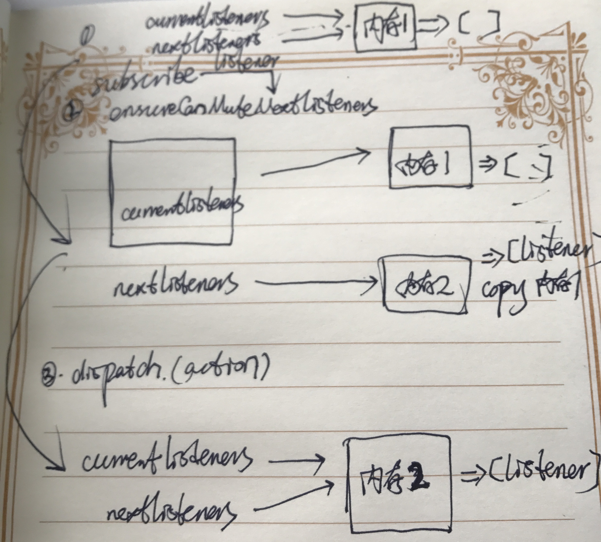

### 1 Array.prototype.slice() 会返回一个新的数组对象地址

```javascript
var currentListeners = [1,2,3];
var nextListeners = currentListeners;
console.log(currentListeners===nextListeners);   //true
if(currentListeners===nextListeners){
  nextListeners = currentListeners.slice();
};
console.log(currentListeners===nextListeners); //false
```

### 2 源码分析

```javascript
//声明全局变量
var currentListeners = [];
var nextListeners = currentListeners ;//两者指向同一块地址，全等比较的时候返回true;
//声明全局函数
function ensureCanMuteNextListeners(){
  if(currentListeners === nextListeners){
    nextListeners = currentListeners.slice() ;//如果执行这个函数，那么两者全等比较就是返回false
  }
};
//声明订阅者函数
function subscribe(listener){
  if(typeof listener !== 'function'){
    throw new Error('Expected function');
  };
  let isSubscribed = true ;
  ensureCanMuteNextListeners();//nextListeners和currentListeners所引用的地址不同了；
  nextListeners.push(listener);
	//形成一个闭包，以便取消订阅的listener
  return function unsubscribe(listener){
    if(!isSubscribed){
      return ;
    };
    ensureCanMuteNextListeners();
    const index = nextListener.indexOf(listener);
    nextListener.splice(index,1);
  }
};
//声明dispatch,执行listeners
function dispatch(action){
  //...some code
  const listeners = currentListeners = nextListeners ;//currentListeners = nextListeners 二者又指向了同一块内存地址
  for(let i = 0;i < listeners.length ;i++ ){
    const listener = listeners[i];
    listener();
  };
  return action;
}
```

### 3 使用分析

在connect组件中有如下函数，在该生命周期中订阅了一个listener;上面的源码中可以看到，每次dispatch就会执行订阅的listener函数；

```javascript
componentDidMount() {
  // 改变Component的state
  //通过subscribe给store注册监听事件，每次dispatch一个action的时候，setState都会执行，从而实现UI的更新
  //所有的组件都会注册在store对象中的listeners,每次state的更新，都会遍历数组触发所有的每个组件的setState,也就是说，只要有state的更新，所有组件的UI都会检查是否进行更新；这也是connect函数的作用；
  this.store.subscribe(() = {
    this.setState({
    storeState: this.store.getState()
  })
})
```

那么在订阅subscribe函数中，ensureCanMuteNextListeners函数的作用是什么呢？

**这是考虑到，在执行某个监听函数的时候，可能会添加新的监听函数，或者取消某个监听函数。为了让这些改变不影响当前的监听函数列表的执行，因此在改变之前，先拷贝一份副本（即nextListeners），然后对该副本进行操作，从而所有的改变会在下一次dispatch(action)的时候生效**；

比如说

```javascript
store.subscribe(()=>{
  console.log('执行订阅函数');
  store.subscribe(()=>{
    console.log('此时订阅的函数不会执行')
  })
})
```



