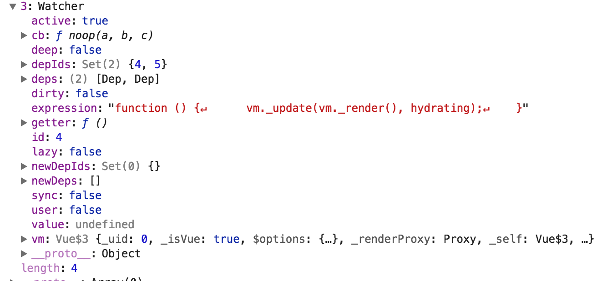
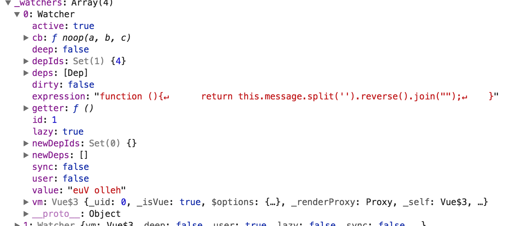
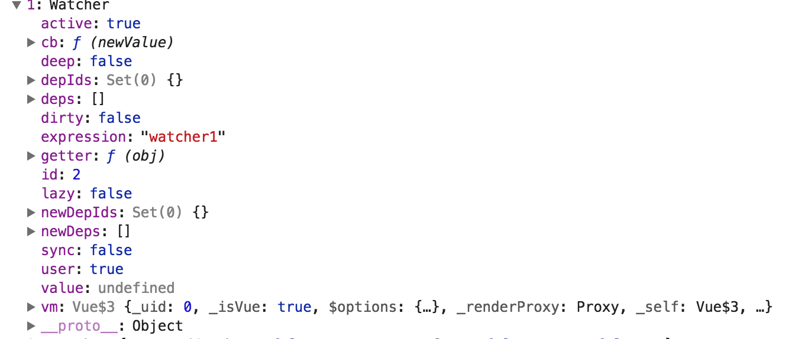
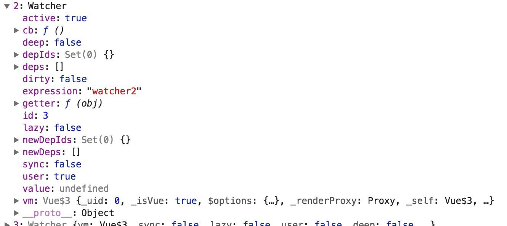
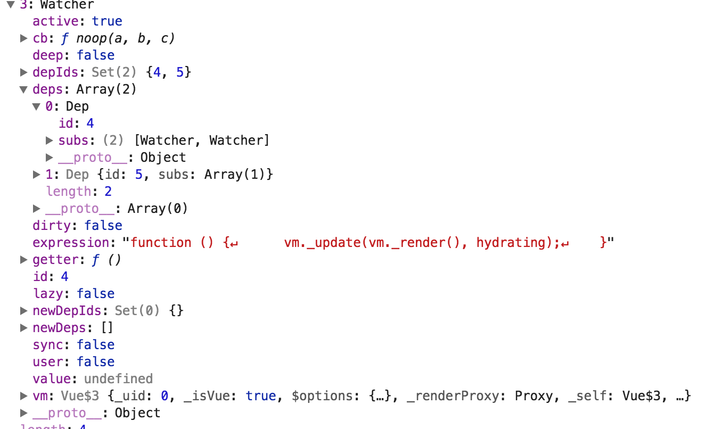

### 1 先来看下下面这个demo

整体上要把握Vue的Observe和Watchery以及Dep之间的关系：

1. Vue 实例初始化的过程中，首先，每个数据项都会生成一个 Observer，每个 Observer 又会初始化一个 Dep 实例；
2. 接下来，模板中的每个指令和数据绑定都会生成一个 Watcher 实例，实例化的过程中，会计算这个 Watcher 对应表达式的值；
3. 计算开始之前，Watcher 会设置 Dep 的静态属性 Dep.target 指向其自身，开始依赖收集；
4. 计算表达式的过程中，该 Watcher 依赖的数据项会被访问，从而触发其 getter 中的代码；
5. 数据项 getter 中会判断 Dep.target 是否存在，若存在则将自身的 Dep 实例保存到 Watcher 的列表中，并在此 Dep 实例中注册 Watcher 为订阅者；
6. 重复上述过程直至 Watcher 计算结束，Dep.target 被清除，依赖收集完成；

```html
<body id='mybody'>
  <div id='example'>
    <p>我是静态staticRenderFns</p>
    <p>this is {{message}}</p>
    <p>this is computed {{reverseMessage}}</p>
    <p>this is method {{reverseMessageM()}}</p>
    <p>{{watchMessage}}</p>
  </div>
    
  
</body>
<script>
  //类名如果带有 — 字符，比如 text-danger,那么就必须加上引号，如果没有 - ，那么就不需要加引号；
var vm = new Vue({
  // el:document.getElementById('example'),
  el:"#example",
  // el:document.querySelector('#example'),
  //这是Vue实例的属性
  data:{
    message:"hello Vue",
    watchMessage:"original",
    
  },
  //这是一个计算属性
  computed:{
    reverseMessage:function(){
      return this.message.split('').reverse().join("");
    }
  },
  methods:{
    reverseMessageM:function(){
      return this.message.split('').reverse().join("");
    },
    otherMessageM:function(){
    }
  },
  watch:{
    watcher1:function(newValue){
      this.watchMessage = this.message;
      console.log('message changed')
    },
    watcher2:function(){}
  }
})
console.log(vm);//输出看下vm._watchers vm._watcher

</script>
```

### 2 Watcher什么时候被添加？

在《new Vue构造函数》2.8处

```javascript
export function initState (vm: Component) {
  vm._watchers = []
  const opts = vm.$options
  //操作props,defineReactive 进行属性的setter/getter的重写
  if (opts.props) initProps(vm, opts.props)
  //将传入vm.$options.methods中的key-value(fn)值给到vm实例对象，同时绑定value(fn)的this为vm
  if (opts.methods) initMethods(vm, opts.methods)
  if (opts.data) {
    //将vm.$options.data给到vm实例属性vm._data (vm.$options.data是经过合并策略处理过的函数)，并侦听data的变化
    //操作data,defineReactive 进行属性的setter/getter的重写
    initData(vm)
  } else {
    observe(vm._data = {}, true /* asRootData */)
  }
  //对于computed：执行 new Watcher()
  if (opts.computed) initComputed(vm, opts.computed)
  if (opts.watch && opts.watch !== nativeWatch) {
    //对于watch:执行new Watcher()
    initWatch(vm, opts.watch)
  }
}
```

对于data：

```javascript
vm._watcher = new Watcher(vm, updateComponent, noop)
```

控制台输出看下

* 对于data的watcher:



* 对于computed的watcher:



* 对于watch1,watcher2的watcher:





* dep



### 3 添加Watcher的时候做了什么工作？

* 每次执行new Watcher的时候，都会执行data，computed,watch这些属性的getter函数，其中data中的属性中的getter/setter是经过defineReactive重写了的，而computed的getter就是该属性对应的函数；
* 执行这些属性的getter会向这些属性的依赖dep中添加对应的watcher，往依赖dep中subs数组中添加观察者实例对象Watcher
* 以后每次更新这些属性值（触发setter)的时候，就会执行设置getter的时候订阅者Watcher的update函数，进行更新；
* updateComponent就会重新渲染UI视图，从而实现双向数据绑定；

### 4 **getter和setter存在的缺陷：只能监听到属性的更改，不能监听到属性的删除与添加。**

案例: 对象

```Vue
<div id="app2" >
  {{ message + name }}
  <div>
    {{deeper.name}}
  </div>
  <div>=======</div>
  <div>
    {{deeper.newSet}}
  </div>
  <button @click='delIt'>删除</button>
  <button @click='setIt'>增加</button>
</div>
```

```javascript
  var app2 = new Vue({
    el: '#app2',
    name:'myApp2',
    data: {
      message: 'Hello Vue!',
      name:'Jhon',
      deeper:{name:'deepName'}
      // deeper:'deepname'
    },
    methods:{
      delIt(){
        console.log('del')
        // delete this.name  不会响应式，虽然已经删除了对应的属性值，但是不是响应式的
        Vue.delete(this,'name') // Vue拒绝删除位于实例根上的属性值
        Vue.delete(this.deeper,'name') //可以删除，并且还是响应式的

      },
      setIt(){
        this.deeper.name = '起作用' //对于有的属性，起作用
        this.deeper.newSet = '不起作用';//对于没有的属性，不起作用
        console.log(this.deeper.newSet) ;//可以看到有输出值，但是并不是响应式的
        // Vue.set(this.deeper,'newSet','newSetValue') //只能通过Vue.set方法增加属性才会起到同步更新视图的作用
      }
    }

  });
```

案例： 数组

```Vue
<div id="app3">

  <div v-for ='item in items2'>
    {{item.text}}
  </div>
  <div v-for ='item in items1'>
    {{item}}
  </div>
  <button @click='changeItems1'>changeItems1</button>
  <button @click='changeItems2'>changeItems2</button>
</div>
```

```javascript
var app3 = new Vue({
  el: '#app3',
  data: {
    items1:[1,2,3],
    items2:[{text:'text1'},{text:'text2'},{text:'text3'}]
  },
  methods:{
    changeItems1(){
      console.log('change') //不会对数组元素进行监听
      this.items1[1] = '4';//不会对数组元素进行监听
      this.items1.push(5) //Vue重写了push;有时间再研究
    },
    changeItems2(){
      console.log('change2');
      this.items2[1] = {text:'aaa'};//不会对数组元素进行监听
      // this.items2[1].text = 'changedText' //会对数组元素中是对象的属性的变化进行监听
    }
  }
})
```


