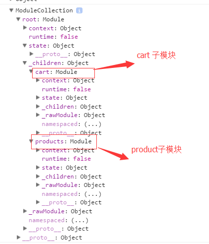

接上《Vuex实例化store对象ModuleCollection的实现》

### 1 使用

```javascript
// new Vuex.Store(options)
const userStore = new Vuex.Store({
  state: {
    userInfo: {}
  },
  getters: {
    getUserInfo(state) {
      return state.userInfo;
    }
  },
  mutations: {
    setUserInfo(state, userInfo) {
      state.userInfo = userInfo;
    }
  },
  actions: {
    setUserInfo({ commit }, user) {
      commit('setUserInfo', user);
    }
  },
  /**
  cart 和 products也是类似于这个结构
  modules: {
    cart,
    products
  },
  */
});
console.log(userStore);//可以输出看下结果
```

###   2 源码实现

**这篇文章主要解释 installModule   resetStoreVM：**

```javascript
export class Store {
  constructor (options = {}) {
    const {
      plugins = [],
      strict = false
    } = options

    // store internal state
    this._committing = false
       //主模块和子模块所有的 actions 会被添加到这里
    this._actions = Object.create(null)
    this._actionSubscribers = []
      //主模块和子模块所有的 mutations 会被添加到这里
    this._mutations = Object.create(null)
      //主模块和子模块所有的 getters 会被添加到这里
    this._wrappedGetters = Object.create(null)
      //本文主要解释  ModuleCollection的实现
    this._modules = new ModuleCollection(options)
      //主模块和子模块中执行installModule中对于模块中设置了namespaced：true的，会被添加到这个对象中
    this._modulesNamespaceMap = Object.create(null)
    this._subscribers = []
    this._watcherVM = new Vue()

    // bind commit and dispatch to self
    const store = this
    const { dispatch, commit } = this
    this.dispatch = function boundDispatch (type, payload) {
      return dispatch.call(store, type, payload)
    }
    this.commit = function boundCommit (type, payload, options) {
      return commit.call(store, type, payload, options)
    }

    // strict mode
    this.strict = strict
//这里就是options中的state 详见《Vuex实例化对象ModuleCollection实现》
    const state = this._modules.root.state

    // init root module.
    // this also recursively registers all sub-modules
    // and collects all module getters inside this._wrappedGetters
    
    installModule(this, state, [], this._modules.root)

    // initialize the store vm, which is responsible for the reactivity
    // (also registers _wrappedGetters as computed properties)
    resetStoreVM(this, state)

    // apply plugins
    plugins.forEach(plugin => plugin(this))

    if (Vue.config.devtools) {
      devtoolPlugin(this)
    }
  }
    //注意下 面的对象的getter和setter
    // 当访问this.state（store.state) 的时候，会触发这个get函数
  get state () {
    return this._vm._data.$$state
  }
// 当设置this.state = something的时候，会触发这个set函数
  set state (v) {
    if (process.env.NODE_ENV !== 'production') {
      assert(false, `Use store.replaceState() to explicit replace store state.`)
    }
  }

// .......
}
```

#### 2. 1   installModule(this, state, [], this._modules.root)

installModule 方法是把我们通过 options 传入的各种属性模块注册和安装；

```javascript
//store：store实例对象；rootState:options.state;path:[],module:store._modules.root
//详见《Vuex实例化对象ModuleCollection源码实现》
function installModule (store, rootState, path, module, hot) {
  //表示 new Vuex.Store(options)中调用 是否为根元素
  const isRoot = !path.length  //true
  //获取我们传入options中的namespace 获取命名空间
  const namespace = store._modules.getNamespace(path) 
  //这里对于主模块 path:[], namespace ==> ''
  //对于子模块 path:['cart'],namespace ==> 'cart/'
	/**
	getNamespace (path) {
    	let module = this.root
    	return path.reduce((namespace, key) => {
      	module = module.getChild(key)
      		return namespace + (module.namespaced ? key + '/' : '')
    	}, '')
  	}
  	//这里可以看到如果我们设置了module.namespaced:true,那么它的所有 getter、action 及 mutation 都会自动根据模块注册的路径调整命名。所以在commit的变化如下：commit('mutationName') ==>commit('moduleName/mutationName')
	**/
  // register in namespace map 在module构造函数中
  /*get namespaced () {
    return !!this._rawModule.namespaced
  }
*/
  if (module.namespaced) {
    store._modulesNamespaceMap[namespace] = module
  }

  // set state
  //  
  //对于主模块 !isRoot:false. !hot:true. 无法进入该循环
  //对于子模块 !isRoot:true !hot:true. 可以进入循环
  if (!isRoot && !hot) {
    const parentState = getNestedState(rootState, path.slice(0, -1))
    const moduleName = path[path.length - 1]
    //将模块的state添加到state链中，是的可以按照 state.moduleName 访问
    store._withCommit(() => {
      //确保属性被创建后也是响应式的,相当于给store.state.cart = cart.state
  //store.state = {cart:{},products:{},{主模块state}} //假如cart和products是两个modules的state
      Vue.set(parentState, moduleName, module.state)
    })
  }
  /**
  make localized dispatch, commit, getters and state
 * if there is no namespace, just use root ones
  模块上下文*/
  //module:store._modules.root.context = local ==> {dispatch,commit,getters,state}
  const local = module.context = makeLocalContext(store, namespace, path)
//module:store._modules.root = new Module(rawModule, runtime)
  // 注册对应模块的mutation，供state修改使用  store._mutations
  module.forEachMutation((mutation, key) => {
    const namespacedType = namespace + key
    registerMutation(store, namespacedType, mutation, local)
  })
// 注册对应模块的action，供数据操作、提交mutation等异步操作使用  store._actions
  module.forEachAction((action, key) => {
    const type = action.root ? key : namespace + key
    const handler = action.handler || action
    registerAction(store, type, handler, local)
  })
 // 注册对应模块的getters，供state读取使用   store._wrappedGetters

  module.forEachGetter((getter, key) => {
    const namespacedType = namespace + key
    registerGetter(store, namespacedType, getter, local)
  })
  //store._mutation[type]   store._action[type]  store._wrappedGetters[type]都是数组，里面存放着要调用的函数
//这里对子模块进行同样的操作
  module.forEachChild((child, key) => {
    installModule(store, rootState, path.concat(key), child, hot)
  })
}
//以上操作之后，store._mutation  store._action  store._wrappedGetters  store.getters上就有了主模块以及所有子模块里面的 getters  mutations  actions  
function getNestedState (state, path) {
  return path.length
    ? path.reduce((state, key) => state[key], state)
    : state
}
function makeLocalContext (store, namespace, path) {
  const noNamespace = namespace === ''

  const local = {
    dispatch: noNamespace ? store.dispatch : (_type, _payload, _options) => {
      const args = unifyObjectStyle(_type, _payload, _options)
      const { payload, options } = args
      let { type } = args

      if (!options || !options.root) {
        type = namespace + type
        if (process.env.NODE_ENV !== 'production' && !store._actions[type]) {
          console.error(`[vuex] unknown local action type: ${args.type}, global type: ${type}`)
          return
        }
      }

      return store.dispatch(type, payload)
    },

    commit: noNamespace ? store.commit : (_type, _payload, _options) => {
      const args = unifyObjectStyle(_type, _payload, _options)
      const { payload, options } = args
      let { type } = args

      if (!options || !options.root) {
        type = namespace + type
        if (process.env.NODE_ENV !== 'production' && !store._mutations[type]) {
          console.error(`[vuex] unknown local mutation type: ${args.type}, global type: ${type}`)
          return
        }
      }

      store.commit(type, payload, options)
    }
  }

  // getters and state object must be gotten lazily
  // because they will be changed by vm update
  Object.defineProperties(local, {
    getters: {
      get: noNamespace
        ? () => store.getters
        : () => makeLocalGetters(store, namespace)
    },
    state: {
      //个体local对象注册state属性，local.state可以通过该get函数取到模块的state
      get: () => getNestedState(store.state, path)
    }
  })

  return local
}

function registerMutation (store, type, handler, local) {
  const entry = store._mutations[type] || (store._mutations[type] = [])
  entry.push(function wrappedMutationHandler (payload) {
    //注册在store对象中options中的mutations中的函数接受的参数如下：local.state   payload
    handler.call(store, local.state, payload)
  })
}

function registerAction (store, type, handler, local) {
  const entry = store._actions[type] || (store._actions[type] = [])
  entry.push(function wrappedActionHandler (payload, cb) {
    let res = handler.call(store, {
      dispatch: local.dispatch,
      commit: local.commit,
      getters: local.getters,
      state: local.state,
      rootGetters: store.getters,
      rootState: store.state
    }, payload, cb)
    if (!isPromise(res)) {
      res = Promise.resolve(res)
    }
    if (store._devtoolHook) {
      return res.catch(err => {
        store._devtoolHook.emit('vuex:error', err)
        throw err
      })
    } else {
      return res
    }
  })
}

function registerGetter (store, type, rawGetter, local) {
  // getters只允许存在一个处理函数，若重复需要报错
  if (store._wrappedGetters[type]) {
    if (process.env.NODE_ENV !== 'production') {
      console.error(`[vuex] duplicate getter key: ${type}`)
    }
    return
  }
  store._wrappedGetters[type] = function wrappedGetter (store) {
    //rawGetter就是每一个getter对应的函数，该函数其实是接受四个参数，如下local表示每一个模块的，store表示全局唯一个store
    return rawGetter(
      local.state, // local state
      local.getters, // local getters
      store.state, // root state
      store.getters // root getters
    )
  }
}
```

**最重要的一点：以上操作之后，`store._mutation  store._action  store._wrappedGetters  store.getters:（这个是在resetStoreVM上添加的）`上就有了主模块以及所有子模块里面的 getters  mutations  actions  ，这里为为什么在任何子组件中可以通过辅助函数，拿到store中不同模块中的getters  mutations  actions埋下了伏笔**



#### 2.2      resetStoreVM(this, state)

主要作用：

* 注册`store._vm`(只有注册了 `store._vm`,才能访问到store.state)
* 注册store.getters

```javascript
//const state = this._modules.root.state
function resetStoreVM (store, state) {
  const oldVm = store._vm // 缓存前vm组件,第一次初始化store实例对象的时候，该值为undefined
 
  // bind store public getters
  store.getters = {}
  const wrappedGetters = store._wrappedGetters
  const computed = {}
 
  // 循环所有处理过的getters，并新建computed对象进行存储，通过Object.defineProperty方法为getters对象建立属性，使得我们通过this.$store.getters.xxxgetter能够访问到该getters
  forEachValue(wrappedGetters, (fn, key) => {
    // use computed to leverage its lazy-caching mechanism
    computed[key] = () => fn(store) //这个和registerGetter中是一致的，可以对比着看下
    Object.defineProperty(store.getters, key, {
      get: () => store._vm[key], //这里可以直接访问到computed中的key对应的()=>fn(store)
      enumerable: true // for local getters
    })
  })
 
  // use a Vue instance to store the state tree
  // suppress warnings just in case the user has added
  // some funky global mixins
  const silent = Vue.config.silent
 
  // 暂时将Vue设为静默模式，避免报出用户加载的某些插件触发的警告
  Vue.config.silent = true   
  // 设置新的store._vm，将当前初始化的state以及getters作为computed属性（刚刚遍历生成的）
  store._vm = new Vue({
    data: { state },
    computed
  })
 
  // 恢复Vue的模式
  Vue.config.silent = silent
 
  // enable strict mode for new vm
  if (store.strict) {
    // 该方法对state执行$watch以禁止从mutation外部修改state
    enableStrictMode(store)
  }
 
  // 若不是初始化过程执行的该方法，将旧的组件state设置为null，强制更新所有监听者(watchers)，待更新生效，DOM更新完成后，执行vm组件的destroy方法进行销毁，减少内存的占用
  if (oldVm) {
    // dispatch changes in all subscribed watchers
    // to force getter re-evaluation.
    store._withCommit(() => {
      oldVm.state = null
    })
    Vue.nextTick(() => oldVm.$destroy())
  }
}

```

### 3 思考：为什么store中的state改变会触发UI视图的更新？这个和组件中的data更新触发视图更新一样吗？

* 核心关注点1：store.state. 和  组件中的 options.data

```javascript
//store中 
store._vm = new Vue({
    data: { state },
    computed
  })
//组件中
new Vue({
    data:{}
}).mount('#el')
```

两者相同点：都执行了new Vue 实例化的过程

两者不同点：store没有执行mount过程，而Vue组件是执行了mount过程（双向绑定是在mount过程中实现的）

* 核心关注点2: 所有的Vue实例对象，在实现双向绑定的时候，其实是共享的**全局**依赖Dep对象

**所以在挂载组件的时候，会执行 `vm._watcher = new Watcher(vm, updateComponent, noop)` ，这里会触发store中data的getter函数以及 组件中data的getter函数，进而实现了将依赖添加到store的state中，从而在state更新的时候，会触发组件的更新流程**


