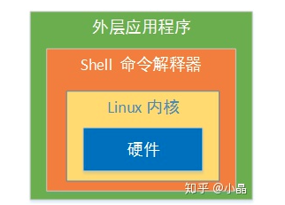

[shell-command-list](http://www.tutorialspoint.com/unix_commands/index.htm)

Shell是什么？

Shell 是一个命令解释权，它为用户提供了一个向 Linux 内核发送请求以便运行程序界面系统级程序，用户可以用 Shell 来启动、挂起、停止甚至是编写一些程序。



查看当前mac下JDK

```
打开终端：/usr/libexec/java_home -V（V必须大写）

1.8.0_131, x86_64:	"Java SE 8"	/Library/Java/JavaVirtualMachines/jdk1.8.0_131.jdk/Contents/Home
/Library/Java/JavaVirtualMachines/jdk1.8.0_131.jdk/Contents/Home

以上输出分别表示：输入命令； 当前Mac已安装jdk目录； Mac默认使用的jdk版本；
```

### 0 PATH

```
PATH=/usr/local/opt/php@7.1/sbin:/usr/local/opt/php@7.1/bin:/Users/didi/.nvm/versions/node/v11.2.0/bin:/usr/local/bin:/usr/bin:/bin:/usr/sbin:/sbin
```

关于PATH的作用：
PATH说简单点就是一个字符串变量，当输入命令的时候LINUX会去查找PATH里面记录的路径。比如在根目录/下可以输入命令ls,在/usr目录下也可以输入ls,但其实ls这个命令根本不在这个两个目录下，事实上当你输入命令的时候LINUX会去/bin,/usr/bin,/sbin等目录下面去找你此时输入的命令，而PATH的值恰恰就是/bin:/sbin:/usr/bin:……。

其中的冒号使目录与目录之间隔开。

打开终端

```javascript
cd /usr/bin  //进入这个目录
ls //可以看到该目录下所有的命令文件了
```

关于新增自定义路径：

假如你新安装了一个命令，这里就以`flutter`为例[flutter](https://flutter.dev/docs/get-started/install/macos)

打开一个终端

```
export PATH="$PATH:[PATH_TO_FLUTTER]/flutter/bin"
```

此时执行`flutter -v`,发现可以在终端执行 `flutter`命令行；

如果在新打开一个终端执行`flutter`发现又不生效了，此时需要配置下

**.bash_profile** ：定义了用户的个人化路径与环境变量的文件名称。每个用户都可使用该文件输入专用于自己使用的shell信息,当用户登录时,**该文件仅仅执行一次**。

**.bashrc** ：该文件包含专用于你的shell的bash信息,**当登录时以及每次打开新的shell时,**该该文件被读取。例如你可以将用户自定义的alias或者自定义变量写到这个文件中。

将以上`export PATH="$PATH:[PATH_TO_FLUTTER]/flutter/bin"`写入该文件中即可。

### 1 目录相关操作(列表 ，移动，删除，复制等)

* ls  列出当前目录

```
-a ：全部的文件，连同隐藏档( 开头为 . 的文件) 一起列出来(常用)   ls -a
-d ：仅列出目录本身，而不是列出目录内的文件数据(常用)           ls-d
-l ：长数据串列出，包含文件的属性与权限等等数据；(常用)			ls-l
```

* Linux系统中使用以下命令来查看文件的内容：

```
- cat  由第一行开始显示文件内容
- tac  从最后一行开始显示，可以看出 tac 是 cat 的倒著写！
- nl   显示的时候，顺道输出行号！
- more 一页一页的显示文件内容
- less 与 more 类似，但是比 more 更好的是，他可以往前翻页！
- head 只看头几行
- tail 只看尾巴几行
```

* Linux系统中编辑文件内容. 

```
touch filename 可以用来创建一个文件名
命令模式   <—ESC————i a s —>输入模式     
命令模式   <-ESC ———— : > 底线命令模式 
```

* who 可以用来看终端的个数；
* users：查看登录用户
* which: 可以查看某个命令所在的位置，通过该位置可以看具体的详细信息；
* pwd: 打印出当前所在目录
* mkdir ： 新建一个目录
* rmdir : 删除一个目录；
* cd: 进入某一级目录；
* rm 删除一个文件(注意只有在提供 -r 选项的时候，才可以删除目录)，-f 强制删除一个文件(删除一个不存在的文件加这个选项不会报错)  -i 用户删除文件的时候回有一个提示 ; rm -rf
* cp 可以用来copy一个文件，`cp [选项][ 来源文件 ] [目的文件] `选项 -r 可以用来copy目录， -i 有一个提示 -u 仅当目标文件存在才会考虑
* mv :` mv [选项][来源文件][目的文件]`  可以用来重命名目录: mv  ./README.md  ./new.md重命名当前目录下的README.md为 new.md，内容不变；
* redir: 删除一个目录,不能删除一个文件
* alias：用于设置一个命令的别名
* whoami: 显示用户名
* clear: 清空终端所有的内容
* grep : 过滤 可以用来对之前的某个命令的结果进行过滤  ls | grep 'work'  那么只会列出包括 work的文件夹 grep -i 等
* ps  ps -f :列出电脑中运行的所有程序  ps -f | grep local   同样可以过滤某些本地服务,每一个process有两个ID,pid表示当前这个程序的process id ; ppid表示这个进程的 Parent process ID
* kill pid  :终止某个进程
* top : 在终端列出所有process,这是一个动态工具，可以实时的展示物理和虚拟内存，以及cpu 等其他状态\
* ping  hostname or ip-address: ping google.com    ping  172.24.40.92  等等；The **ping** command sends an echo request to a host available on the network. Using this command, you can check if your remote host is responding well or not.主要作用是检测你的远程host是否正常工作；
* finger：The **finger** command displays information about users on a given host. The host can be either local or remote.

```javascript
//ps -f
UID   PID  PPID   C STIME   TTY           TIME CMD
  501  1606   891   0 10:42上午 ttys000    0:00.76 /bin/zsh -l
  501  2447   891   0 10:45上午 ttys001    0:00.69 /bin/zsh -l
  501  3373  3371   0 10:47上午 ttys002    0:00.66 /bin/zsh -l
  501  4220  3371   0 10:50上午 ttys003    0:00.70 /bin/zsh -l
  501 10292  7884   0 11:35上午 ttys004    0:00.03 /Applications/iTerm.app/Contents/MacOS/iTerm2 --server login -fp didi
  501 10294 10293   0 11:35上午 ttys004    0:00.74 -zsh
  501 11552   891   0 11:55上午 ttys005    0:00.56 /bin/zsh -l
  501 12297 11552   0 11:55上午 ttys005    0:00.28 npm
  501 12298 12297   0 11:55上午 ttys005    0:49.58 node build/dev-server.js
  501 12299 12298   0 11:55上午 ttys005    0:00.06 open -W http://localhost:8002
//top
Processes: 369 total, 2 running, 367 sleeping, 2187 threads            12:04:29
Load Avg: 1.69, 1.33, 1.26  CPU usage: 10.55% user, 11.51% sys, 77.93% idle
SharedLibs: 120M resident, 35M data, 10M linkedit.
MemRegions: 92676 total, 2211M resident, 62M private, 606M shared.
PhysMem: 7869M used (1989M wired), 322M unused.
VM: 1735G vsize, 1112M framework vsize, 58050(0) swapins, 66513(0) swapouts.
Networks: packets: 3950471/971M in, 2152717/346M out.
Disks: 1356211/14G read, 572369/5321M written.
```


### 2 vi

* vi filename 创建一个文件
* cat filename  显示文件的内容
* cat -b filename 显示文件的内容的同时，页显示内容中每行对应的行数
* wc filename 显示文件to get a count of the total number of lines, words, and characters contained in a file

### 3 shell脚本 && 环境变量

#### 3.1 基本概念

概念： 简单点理解，就是系统跟计算机硬件交互时使用的中间介质，它只是系统的一个工具。实际上，在shell和计算机硬件之间还有一层东西那就是系统内核了。打个比方，如果把计算机硬件比作一个人的躯体，而系统内核则是人的大脑，至于shell，把它比作人的五官似乎更加贴切些。回到计算机上来，用户直接面对的不是计算机硬件而是shell，用户把指令告诉shell，然后shell再传输给系统内核，接着内核再去支配计算机硬件去执行各种操作。

上边提到了alias，也提到了绝对路径的/bin/rm ，然后你意识到没有，为什么我们输入很多命令时是直接打出了命令，而没有去使用这些命令的绝对路径？这是因为环境变量PATH在起作用了。请输入 echo $PATH，这里的echo其实就是打印的

意思，而PATH前面的$表示后面接的是变量。

首先它是一个脚本，并不能作为正式的编程语言。因为是跑在linux的shell中，所以叫shell脚本。说白了，shell脚本就是一些命令的集合。举个例子，我想实现这样的操作：1）进入到/tmp/目录；2）列出当前目录中所有的文件名；3）把所有当前的文件拷贝到/root/目录下；4）删除当前目录下所有的文件。简单的4步在shell窗口中需要你敲4次命令，按4次回车。这样是不是很麻烦？当然这4步操作非常简单，如果是更加复杂的命令设置需要几十次操作呢？那样的话一次一次敲键盘会很麻烦。所以不妨把所有的操作都记录到一个文档中，然后去调用文档中的命令，这样一步操作就可以完成。其实这个文档呢就是shell脚本了，只是这个shell脚本有它特殊的格式。

凡是自定义的脚本建议放到/usr/local/sbin/目录下

* echo: 输出
* env: 列出系统的全部环境变量
* set : 列出系统的全部变量
* date: 显示当前系统的时间
* $PATH：这个环境变量就是shell预设的一个变量，通常shell预设的变量都是大写的。变量，说简单点就是使用一个较简单的字符串来替代某些具有特殊意义的设定以及数据。**就拿PATH来讲，这个PATH就代替了所有常用命令的绝对路径的设定。因为有了PATH这个变量，所以我们运行某个命令时不再去输入全局路径，直接敲命令名即可**,输入命令之后，系统就会去$PATH中所有的路径中去找有没有对应的命令可以执行，然后进行执行；
* export: 声明一个全局变量
* unset: 取消某个全局变量

我们在给 $PATH 常量赋值的时候，经常会有如下操作，最后的 $PATH其实是为了保留上次的值

[参考文档](http://www.92csz.com/study/linux/12.htm)

```java
export PATH="/usr/local/opt/php@7.1/bin:$PATH"
export PATH="/usr/local/opt/php@7.1/sbin:$PATH"
```

```javascript
export TESTPATH=123
echo $TESTPATH //123
export TESTPATH=456:$TESTPATH
echo $TESTPATH //456:123
```

然后输入 env,可以看到 TESTPATH这个全局变量；

```javascript
// ...
	//其他全局变量
TESTPATH=456:123
// ...
```

然后可以通过 unset 命令取消全局变量，unset TESTPATH

```javascript
//...
	//其他全局变量
//...
```

切换终端的命令

```javascript
chsh -s /bin/zsh  //bash 等
```

查看系统中所有的终端

```javascript
cat /etc/shells
```

输入如下

```javascript
/bin/bash
/bin/csh
/bin/ksh
/bin/sh
/bin/tcsh
/bin/zsh
```

对于vscode如何设置终端默认为 zsh? 可以通过设置里面更改配置进行操作；

```javascript
"terminal.integrated.shell.osx": "/bin/bash",
"terminal.integrated.shell.linux": "/bin/bash",
```

```javascript
"terminal.integrated.shell.osx": "/bin/zsh",
"terminal.integrated.shell.linux": "/bin/zsh",
```

**.bash_profile** ：定义了用户的个人化路径与环境变量的文件名称。每个用户都可使用该文件输入专用于自己使用的shell信息,当用户登录时,**该文件仅仅执行一次**。

`.bash_profile`文件只会对指定的`shell`类型起作用，`.bash_profile`只会被`bash shell`调用

如果你用了其他的`shell`，比如 `zsh`，那么对应的是 `.zsh_profile`

**.bashrc** ：该文件包含专用于你的shell的bash信息,**当登录时以及每次打开新的shell时,**该该文件被读取。例如你可以将用户自定义的alias或者自定义变量写到这个文件中。

`.bashrc`文件只会对指定的`shell`类型起作用，`bashrc`只会被`bash shell`调用。

如果你用了其他的`shell`，比如`zsh `那么对应的是`.zshrc`

**.bash_history** ：记录命令历史用的。

**.bash_logout** ：当退出shell时，会执行该文件。可以把一些清理的工作放到这个文件中。

#### 3.2 shell script

##### read ：the **read** command which takes the input from the keyboard and assigns it as the value of the variable PERSON and finally prints it on STDOUT.

```sh
#!/bin/sh

# Author : Zara Ali
# Copyright (c) Tutorialspoint.com
# Script follows here:

echo "What is your name?"
read PERSON
echo "Hello, $PERSON"

```

##### 注释和执行shell

`#! `表示用哪个sh执行脚本

`#`表示注释

```sh
#!/bin/bash  

# Author : Zara Ali
# Copyright (c) Tutorialspoint.com
# Script follows here:
pwd
ls
```

##### 变量

声明：The name of a variable can contain only letters (a to z or A to Z), numbers ( 0 to 9) or the underscore character ( _).

定义 :variable_name=variable_value

使用：变量的使用可以以 $ 开头(一般建议使用变量的时候以`{}`包起来)

只读：readonly  变量名；

Unsetting 变量

```sh
NAME = 'LUCY';
RE = "readonly"
echo $NAME;
echo ${NAME}
readonly RE
# 声明数组
NAME[0]="Zara"
NAME[1]="Qadir"
NAME[2]="Mahnaz"
NAME[3]="Ayan"
NAME[4]="Daisy"
echo "First Index: ${NAME[0]}"
echo "Second Index: ${NAME[1]}"
```


变量类型

- **Local Variables** − A local variable is a variable that is present within the current instance of the shell. It is not available to programs that are started by the shell. They are set at the command prompt.
- **Environment Variables** − An environment variable is available to any child process of the shell. Some programs need environment variables in order to function correctly. Usually, a shell script defines only those environment variables that are needed by the programs that it runs.
- **Shell Variables** − A shell variable is a special variable that is set by the shell and is required by the shell in order to function correctly. Some of these variables are environment variables whereas others are local variables.

##### shell编程中的特殊变量

`test.sh`

```sh
#!/bin/sh

# Author : Zara Ali
# Copyright (c) Tutorialspoint.com
# Script follows here: $0 表示 执行的脚本文件名 $1~n 表示执行脚本的时候传入的参数
# $# 表示执行脚本时候传入的参数的个数；$$ 表示process number 

echo $0  test.sh   注意这个 $0  并不是代表文件的名称，而是代表 sh 命令后紧接着的路径
echo $1  1
echo $2  2

echo $#  6
echo $*  1 2 3 a b c
echo $@  1 2 3 a b c
echo $?  The exit status of the last command executed.
echo $!
echo $$  eg: 45672 The process number of the current shell. For shell scripts, this is the process ID under which they are executing.
```

 

```
     $0    $1 $2 $3 $4 $5 $6 
sh test.sh 1  2  3  a  b  c 
```

##### shell编程中的基本运算

[参考](http://www.tutorialspoint.com/unix/unix-basic-operators.htm)

##### Command Substitution

```javascript
`command`
```

```sh
DATE=`date`
echo "Date is $DATE"

USERS=`who | wc -l`
echo "Logged in user are $USERS"

UP=`date ; uptime`
echo "Uptime is $UP"

```

##### 特殊字符

```
* ? [ ] ' " \ $ ; & ( ) | ^ < >
```

```sh
NAME="LuCY"
# 所有在单引号之内的特殊字符都将失效
echo 'Hel lo; Word  $NAME '
#的大部分双引号之间的特殊字符将失效，除了 $ ` \$ \' \"  \\
echo "Hel lo; Word  ${NAME}"
```

##### Unix's version of **Help files** are called **man pages**. If there is a command name and you are not sure how to use it, then Man Pages help you out with every step.

`man command`命令可以用来具体解释 `command`命令的具体信息

```
# man command

man pwd  
man ls
man cat
CAT(1)                    BSD General Commands Manual                   CAT(1)

NAME
     cat -- concatenate and print files

SYNOPSIS
     cat [-benstuv] [file ...]

DESCRIPTION
     The cat utility reads files sequentially, writing them to the standard output.  The file operands
     are processed in command-line order.  If file is a single dash (`-') or absent, cat reads from the
     standard input.  If file is a UNIX domain socket, cat connects to it and then reads it until EOF.
     This complements the UNIX domain binding capability available in inetd(8).
```


 ### 3 文件操作&磁盘管理

* cat : 查看某个文件 -n 显示行号 -A 显示出所有东西，包括特殊字符；
* less  more tail head  文件名
* df   du  查看文件大小

### 4 文本编辑工具（vim)

一般模式 -  编辑模式  - 命令模式


### 5 [Linux命令详解](https://www.linuxdaxue.com/linux-commands-manual)

#### ls

```
-a 显示所有文件及目录 (ls内定将文件名或目录名称开头为"."的视为隐藏档，不会列出) 

-l 除文件名称外，亦将文件型态、权限、拥有者、文件大小等资讯详细列出 

-r 将文件以相反次序显示(原定依英文字母次序) 

-t 将文件依建立时间之先后次序列出 

-A 同 -a ，但不列出 "." (目前目录) 及 ".." (父目录) 

-F 在列出的文件名称后加一符号；例如可执行档则加 "*", 目录则加 "/" 

-R 若目录下有文件，则以下之文件亦皆依序列出

```

#### mkdir

```
-m, --mode=模式，设定权限<模式> (类似 chmod)，而不是 rwxrwxrwx 减 umask

-p, --parents  可以是一个路径名称。此时若路径中的某些目录尚不存在,加上此选项后,系统将自动建立好那些尚不存在的目录,即一次可以建立多个目录;

-v, --verbose  每次创建新目录都显示信息 mkdir -v test //提示信息如下：create directory test

    --help   显示此帮助信息并退出

    --version  输出版本信息并退出
```

#### tree  

##### tree -C : 看着比较舒服

```
-a 显示所有文件和目录。 

-A 使用ASNI绘图字符显示树状图而非以ASCII字符组合。 

-C 在文件和目录清单加上色彩，便于区分各种类型。 

-d 显示目录名称而非内容。 

-D 列出文件或目录的更改时间。 

-f 在每个文件或目录之前，显示完整的相对路径名称。 

-F 在执行文件，目录，Socket，符号连接，管道名称名称，各自加上"*","/","=","@","|"号。 

-g 列出文件或目录的所属群组名称，没有对应的名称时，则显示群组识别码。 

-i 不以阶梯状列出文件或目录名称。 

-I<范本样式> 不显示符合范本样式的文件或目录名称。 

-l 如遇到性质为符号连接的目录，直接列出该连接所指向的原始目录。 

-n 不在文件和目录清单加上色彩。 

-N 直接列出文件和目录名称，包括控制字符。 

-p 列出权限标示。 

-P<范本样式> 只显示符合范本样式的文件或目录名称。 

-q 用"?"号取代控制字符，列出文件和目录名称。 

-s 列出文件或目录大小。 

-t 用文件和目录的更改时间排序。 

-u 列出文件或目录的拥有者名称，没有对应的名称时，则显示用户识别码。 

-x 将范围局限在现行的文件系统中，若指定目录下的某些子目录，其存放于另一个文件系统上，则将该子目录予以排除在寻找范围外。
```

### 6 shell脚本编程

shell脚本编程简单来说就是一个 `.sh`文件，这个文件中可以执行一些平时在终端中执行的命令，比如 ls  比如 npm install 比如mkdir ,比如 echo 等等；

`test.sh`

```shell
#!/bin/sh

NAME="Zara Ali"
echo $NAM
mkdir tewt
cat filename
vi test.sh
ls ~
```

执行shell脚本 ` source 和 .` 作用一样

```
source test.sh
. ./test.sh
sh test.sh
```

linux编程中基本命令

0.用户操作

```
login : 登录
passwd:修改用户登录密码
whoami:查看你是谁
users: 查看登录本机的用户

```

1. 文件操作

```
ls : 列出文件列表
vi : 创建文件或者编辑已存在文件
cat:显示文件内容
mv : 重命名文件
rm : 删除、移动文件
cp : 复制文件
mkdir: 创建目录
rmdir:移动某个目录

cd: 改变目录，终端到某个目录，cd ~ ~代表home directory
```

2. 环境 | 管道

```
$PATH  $PWD  $HOME  .... : 全局变量
ls | grep 'didi' : 列出该目录下所有带有 'didi' 的文件或者文件夹
```

| Sr.No. | Option & Description                                         |
| ------ | ------------------------------------------------------------ |
| 1      | **-v**Prints all lines that do not match pattern.            |
| 2      | **-n**Prints the matched line and its line number.           |
| 3      | **-l**Prints only the names of files with matching lines (letter "l") |
| 4      | **-c**Prints only the count of matching lines.               |
| 5      | **-i**Matches either upper or lowercase.                     |

3.进程

Each unix process has two ID numbers assigned to it: The Process ID (pid) and the Parent process ID (ppid). Each user process in the system has a parent process.

Most of the commands that you run have the shell as their parent. Check the **ps -f** example where this command listed both the process ID and the parent process ID.

```
ps
ps -f : 显示终端进程
kill : 杀掉某个进程
```

| Sr.No. | Column & Description                                         |
| ------ | ------------------------------------------------------------ |
| 1      | **UID**User ID that this process belongs to (the person running it) |
| 2      | **PID**Process ID                                            |
| 3      | **PPID**Parent process ID (the ID of the process that started it) |
| 4      | **C**CPU utilization of process                              |
| 5      | **STIME**Process start time                                  |
| 6      | **TTY**Terminal type associated with the process             |
| 7      | **TIME**CPU time taken by the process                        |
| 8      | **CMD**The command that started this process                 |

There are other options which can be used along with **ps** command −

| Sr.No. | Option & Description                                      |
| ------ | --------------------------------------------------------- |
| 1      | **-a**Shows information about all users                   |
| 2      | **-x**Shows information about processes without terminals |
| 3      | **-u**Shows additional information like -f option         |
| 4      | **-e**Displays extended information                       |

4. 交互 | vim编辑器

```
ping: The ping command sends an echo request to a host available on the network. Using this command, you can check if your remote host is responding well or not.
finger:The finger command displays information about users on a given host. The host can be either local or remote.

```

5. what is shell

The shell reads your input after you press Enter. It determines the command you want executed by looking at the first word of your input. A word is an unbroken set of characters. Spaces and tabs separate words.

* Shell types

```
/bin/bash
/bin/csh
/bin/ksh
/bin/sh
/bin/tcsh
/bin/zsh
```

* Shell scripts

Assume we create a test.sh script. Note all the scripts would have .sh extension. Before you add anything else to your script, you need to alert the system that a shell script is being started. This is done using the shebang construct. For example:

```
#!/bin/sh
```

* Shell comments : 以 #  开头

```
# this is comments
```

5.1 变量

- **Local Variables** − A local variable is a variable that is present within the current instance of the shell. It is not available to programs that are started by the shell. They are set at the command prompt.
- **Environment Variables** − An environment variable is available to any child process of the shell. Some programs need environment variables in order to function correctly. Usually, a shell script defines only those environment variables that are needed by the programs that it runs.
- **Shell Variables** − A shell variable is a special variable that is set by the shell and is required by the shell in order to function correctly. Some of these variables are environment variables whereas others are local variables.

```sh
PERSON 
PERSON="jim"
readonly PERSON
PERSON="jhom" //只读变量不允许再次赋值
echo $PERSON
echo ${PERSON}
```

变量名外面的花括号是可选的，加不加都行，加花括号是为了帮助解释器识别变量的边界

5.2 数组

```sh
# 定义数组
array_name[index]=value
# 获取数组值
${array_name[index]}
```

```sh
#!/bin/sh

NAME[0]="Zara"
NAME[1]="Qadir"
NAME[2]="Mahnaz"
NAME[3]="Ayan"
NAME[4]="Daisy"
echo "First Index: ${NAME[0]}"
echo "Second Index: ${NAME[1]}"

AGE=(1 2 3)
echo "First Age Index${AGE[0]}"
echo "Second Age Index${AGE[1]}"
val=`expr 2 + 2`;
```

5.3 Basic Operators

shell 中` ()  (())  [] [[]]` 的使用(https://juejin.im/post/5d46b2c1e51d4561e721de85)

Bourne shell didn't originally have any mechanism to perform simple arithmetic operations but it uses external programs, either **awk** or **expr**

**在 表达式和操作符之间必须有空格；**

```sh
val=`expr 2 + 2`;
echo "${val}"
a=10

b=20
echo `add1:expr $a + $b`
echo `expr $a - $b`
# 乘号需要转移
echo `expr $a \* $b`
echo `expr $b / $a`
echo `expr $b % $a`
c=$a
echo "${c}"
```

计算

|      Operator      |                         Description                          |                Example                |
| :----------------: | :----------------------------------------------------------: | :-----------------------------------: |
|    + (Addition)    |          Adds values on either side of the operator          |      `expr $a + $b` will give 30      |
|  - (Subtraction)   |     Subtracts right hand operand from left hand operand      |     `expr $a - $b` will give -10      |
| * (Multiplication) |       Multiplies values on either side of the operator       |     `expr $a \* $b` will give 200     |
|    / (Division)    |       Divides left hand operand by right hand operand        |      `expr $b / $a` will give 2       |
|    % (Modulus)     | Divides left hand operand by right hand operand and returns remainder |      `expr $b % $a` will give 0       |
|   = (Assignment)   |            Assigns right operand in left operand             | a = $b would assign value of b into a |
|   == (Equality)    |  Compares two numbers, if both are same then returns true.   |   [ $a == $b ] would return false.    |
| != (Not Equality)  | Compares two numbers, if both are different then returns true. |    [ $a != $b ] would return true.    |

比较

| Operator |                         Description                          |          Example           |
| :------: | :----------------------------------------------------------: | :------------------------: |
| **-eq**  | Checks if the value of two operands are equal or not; if yes, then the condition becomes true. | [ $a -eq $b ] is not true. |
| **-ne**  | Checks if the value of two operands are equal or not; if values are not equal, then the condition becomes true. |   [ $a -ne $b ] is true.   |
| **-gt**  | Checks if the value of left operand is greater than the value of right operand; if yes, then the condition becomes true. | [ $a -gt $b ] is not true. |
| **-lt**  | Checks if the value of left operand is less than the value of right operand; if yes, then the condition becomes true. |   [ $a -lt $b ] is true.   |
| **-ge**  | Checks if the value of left operand is greater than or equal to the value of right operand; if yes, then the condition becomes true. | [ $a -ge $b ] is not true. |
| **-le**  | Checks if the value of left operand is less than or equal to the value of right operand; if yes, then the condition becomes true. |   [ $a -le $b ] is true.   |

布尔

| Operator |                         Description                          |                Example                |
| :------: | :----------------------------------------------------------: | :-----------------------------------: |
|  **!**   | This is logical negation. This inverts a true condition into false and vice versa. |         [ ! false ] is true.          |
|  **-o**  | This is logical **OR**. If one of the operands is true, then the condition becomes true. | [ $a -lt 20 -o $b -gt 100 ] is true.  |
|  **-a**  | This is logical **AND**. If both the operands are true, then the condition becomes true otherwise false. | [ $a -lt 20 -a $b -gt 100 ] is false. |

## String Operators

The following string operators are supported by Bourne Shell.

Assume variable **a** holds "abc" and variable **b** holds "efg" then −

[Show Examples](https://www.tutorialspoint.com/unix/unix-string-operators.htm)

| Operator |                         Description                          |         Example          |
| :------: | :----------------------------------------------------------: | :----------------------: |
|  **=**   | Checks if the value of two operands are equal or not; if yes, then the condition becomes true. | [ $a = $b ] is not true. |
|  **!=**  | Checks if the value of two operands are equal or not; if values are not equal then the condition becomes true. |  [ $a != $b ] is true.   |
|  **-z**  | Checks if the given string operand size is zero; if it is zero length, then it returns true. |  [ -z $a ] is not true.  |
|  **-n**  | Checks if the given string operand size is non-zero; if it is nonzero length, then it returns true. | [ -n $a ] is not false.  |
| **str**  | Checks if **str** is not the empty string; if it is empty, then it returns false. |                          |


## File Test Operators

We have a few operators that can be used to test various properties associated with a Unix file.

Assume a variable **file** holds an existing file name "test" the size of which is 100 bytes and has **read**, **write** and **execute** permission on −

[Show Examples](https://www.tutorialspoint.com/unix/unix-file-operators.htm)

|  Operator   |                         Description                          |          Example          |
| :---------: | :----------------------------------------------------------: | :-----------------------: |
| **-b file** | Checks if file is a block special file; if yes, then the condition becomes true. |  [ -b $file ] is false.   |
| **-c file** | Checks if file is a character special file; if yes, then the condition becomes true. |  [ -c $file ] is false.   |
| **-d file** | Checks if file is a directory; if yes, then the condition becomes true. | [ -d $file ] is not true. |
| **-f file** | Checks if file is an ordinary file as opposed to a directory or special file; if yes, then the condition becomes true. |   [ -f $file ] is true.   |
| **-g file** | Checks if file has its set group ID (SGID) bit set; if yes, then the condition becomes true. |  [ -g $file ] is false.   |
| **-k file** | Checks if file has its sticky bit set; if yes, then the condition becomes true. |  [ -k $file ] is false.   |
| **-p file** | Checks if file is a named pipe; if yes, then the condition becomes true. |  [ -p $file ] is false.   |
| **-t file** | Checks if file descriptor is open and associated with a terminal; if yes, then the condition becomes true. |  [ -t $file ] is false.   |
| **-u file** | Checks if file has its Set User ID (SUID) bit set; if yes, then the condition becomes true. |  [ -u $file ] is false.   |
| **-r file** | Checks if file is readable; if yes, then the condition becomes true. |   [ -r $file ] is true.   |
| **-w file** | Checks if file is writable; if yes, then the condition becomes true. |   [ -w $file ] is true.   |
| **-x file** | Checks if file is executable; if yes, then the condition becomes true. |   [ -x $file ] is true.   |
| **-s file** | Checks if file has size greater than 0; if yes, then condition becomes true. |   [ -s $file ] is true.   |
| **-e file** | Checks if file exists; is true even if file is a directory but exists. |   [ -e $file ] is true.   |


[shell脚本](https://github.com/qinjx/30min_guides/blob/master/shell.md)

[unix](http://www.tutorialspoint.com/unix/unix-shell.htm)

[linux命令查找](https://wangchujiang.com/linux-command/c/type.html)


