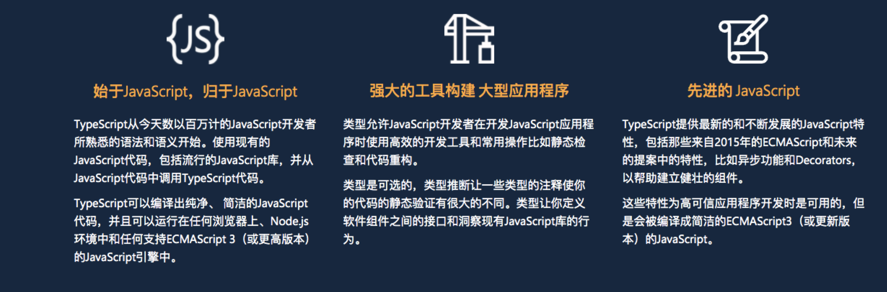
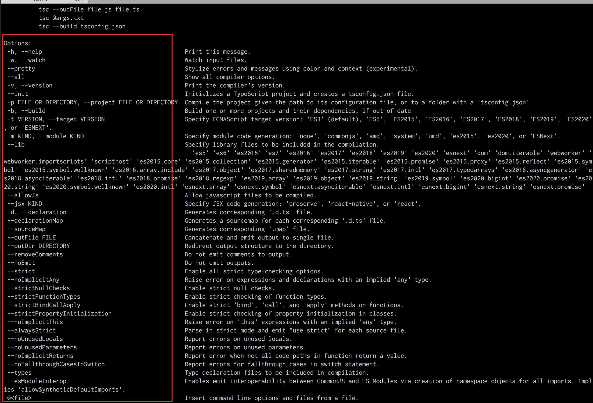
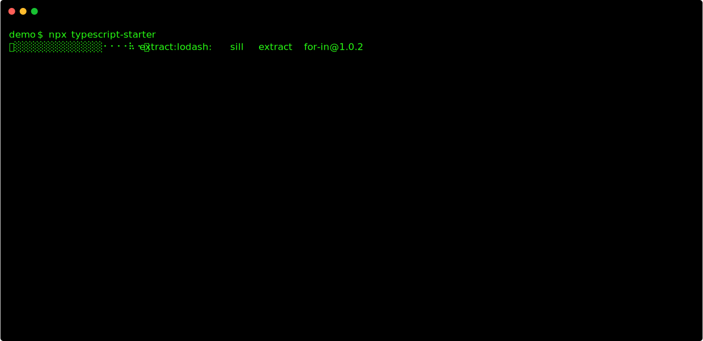

---
tsc命令行的使用
---

### 0.为什么需要typescript?



### 1.tsc命令行的安装与使用

安装

```
npm install -g typescript
```

如何查看更多关于`tsc`的命令？

```
tsc --help
```

想要了解typescript的原理？

[typescript源码-Github](https://github.com/Microsoft/TypeScript)

编译ts

```
tsc helloworld.ts
```

命令行后面的配置项列表如下：https://www.tslang.cn/docs/handbook/compiler-options.html

| `--target` `-t` | `string` | `"ES3"` | 指定ECMAScript目标版本 `"ES3"`（默认）， `"ES5"`， `"ES6"`/ `"ES2015"`， `"ES2016"`， `"ES2017"`或 `"ESNext"`。  注意： `"ESNext"`最新的生成目标列表为 [ES proposed features](https://github.com/tc39/proposals) |
| --------------- | -------- | ------- | ------------------------------------------------------------ |
|                 |          |         |                                                              |

```
 tsc 00.base-ts.ts -t es2017
```


| `--sourceMap` | `boolean` | `false` | 生成相应的 `.map`文件。 |
| ------------- | --------- | ------- | ----------------------- |
|               |           |         |                         |

```
tsc 00.base-ts.ts -t es2017 -sourceMap
```

| `--outDir` | `string` |      | 重定向输出目录。 |
| ---------- | -------- | ---- | ---------------- |
|            |          |      |                  |

```
tsc 00.base-ts.ts -t es2017 --outDir ./tes
```

| `--alwaysStrict` | `boolean` | `false` | 以严格模式解析并为每个源文件生成 `"use strict"`语句 |
| ---------------- | --------- | ------- | --------------------------------------------------- |
|                  |           |         |                                                     |

```
tsc 00.base-ts.ts -t es2017 --alwaysStrict
```

通过`tsc --help`可以看到所有的支持的命令列表，该命令列表支持的命令选项和[tsconfig.json支持配置项](https://www.tslang.cn/docs/handbook/compiler-options.html)基本是一致的



所以typescript支持通过配置文件的形式抽离出来这样的配置项

### 2.tsconfig.json文件解读

[tsconfig.json](https://www.tslang.cn/docs/handbook/tsconfig-json.html)

通过`tsc --init `初始化配置文件

```
tsc --init 
```

修改想要测试的某些配置项

```
tsc filename.ts 
```

执行之后发现是和通过命令行直接指定某些编译能力是一致的

### ts-node

除了`tsc`命令用于编译ts文件之外，还有`ts-node`可以直接在node终端执行ts文件

- Use [ts-node](https://github.com/TypeStrong/ts-node) to run scripts or REPL
- How to make executable typescript scripts:
  1. Make sure you have `npx` (shipped with `npm >= 5.2`) and `typescript` package is installed
  2. Add this [shebang](https://en.wikipedia.org/wiki/Shebang_(Unix)) as first line to your script: `#!npx ts-node`
  3. Make script executable: `chmod +x script.ts`
  4. Run directly: `./script.ts` :)

```bash
# Locally in your project.
npm install -D typescript
npm install -D ts-node

# Or globally with TypeScript.
npm install -g typescript
npm install -g ts-node
```

`node-run.js`

```
const name_node = 'name-node';
console.log(name_node)
```

终端执行`node node-run.js`

`tsnode-run.ts`

```
const name_ts_node:string = 'lucy';
console.log(name_ts_node)
```

终端执行`tsnode tsnode-run.ts`

### 3.如何在项目中使用

强烈推荐的学习资源： [awesome-typescript](https://github.com/dzharii/awesome-typescript)

#### 3.1.项目学习资源

为了更加真实的看到webpack的配置，我找了以下demo,clone到本地即可查看

[ts-examples](https://www.tslang.cn/samples/index.html)

[vue+webpack4+typescript](https://github.com/vok123/typescript-vue-eslint-starter)

[react+webpack4+typescript](https://github.com/bengle/react-typescript-starter)


#### 3.2.终端命令行自定义ts项目

#### 0.注意点

**npm本源可能会安装超级慢，并且会出现安装多次依旧失败的问题，注意这里可以更改安装源**

```bash
cnpm --- http://r.cnpmjs.org/
* taobao - https://registry.npm.taobao.org/
nj ----- https://registry.nodejitsu.com/
rednpm - http://registry.mirror.cqupt.edu.cn/
npmMirror  https://skimdb.npmjs.com/registry/
```

**node版本问题**

以下某些安装过程可能需要较高的node版本，所以需要注意切换到比较高的node版本

```bash
npm view node versions  #罗列所有的node版本信息
nvm #可以用来管理node版本
```


**1.[create-react-app-started](https://create-react-app.dev/docs/getting-started/)**

```sh
npx create-react-app my-app --template typescript
```

所有的模板资源根本上也都是从 npm 下载的，所以具体的资源列表可以参考这里：[cra=template](https://www.npmjs.com/search?q=cra-template-*)

**2.[vue-cli](https://cli.vuejs.org/guide/installation.html)**

```bash
npm install -g @vue/cli
vue create vue-starter
didi@localhost  ~/learn/learnSPace/31learn-ts/cli-ts-project   master ●  npx vue create vue-starter
Vue CLI v4.3.1
┌─────────────────────────────────────────┐
│                                         │
│   New version available 4.3.1 → 4.5.8   │
│    Run npm i -g @vue/cli to update!     │
│                                         │
└─────────────────────────────────────────┘
? Please pick a preset: 
  y (babel, eslint) 
  default (babel, eslint) 
❯ Manually select features 

# 选择 ❯ Manually select features 
接下来选择 typescript即可
```


**3[typescript-starter](https://github.com/bitjson/typescript-starter)**

```
npx typescript-starter
```




