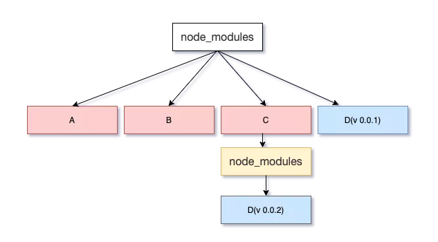
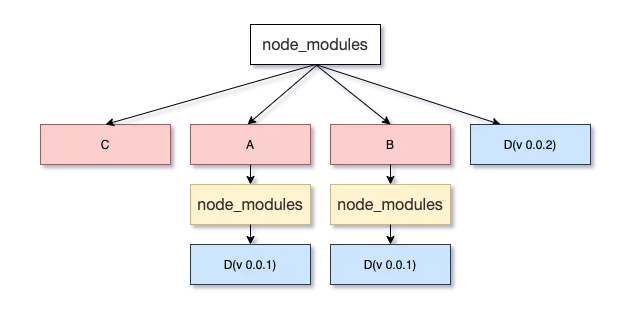

---
title:package.json解析
---

### 1 依赖的版本解析    

- Major releases(主版本号):  当你做了不兼容的 API 修改 
- Minor releases(次版本号): 当你做了向下兼容的功能性新增，可以理解为Feature版本
- Patch releases(修订号): 当你做了向下兼容的问题修正，可以理解为Bug fix版本。

**版本号格式： 主版本号.次版本号.修订号**  

```javascript
{ "dependencies" :
  { "foo" : "1.0.0 - 2.9999.9999"
  , "bar" : ">=1.0.2 <2.1.2"
  , "baz" : ">1.0.2 <=2.3.4"
  , "boo" : "2.0.1"
  , "qux" : "<1.0.0 || >=2.3.1 <2.4.5 || >=2.5.2 <3.0.0"
  , "asd" : "http://asdf.com/asdf.tar.gz"
  , "til" : "~1.2"
  , "elf" : "~1.2.3"
  , "two" : "2.x"
  , "thr" : "3.3.x"
  , "lat" : "latest"
  , "dyl" : "file:../dyl" //本地开发的库；
  }
}
```

- `version` Must match `version` exactly
- `>version` Must be greater than `version`
- `>=version` etc
- `<version`
- `<=version`
- `~version` "Approximately equivalent to version" See [semver](https://docs.npmjs.com/misc/semver)(近似等于这个版本)
- `^version` "Compatible with version" See [semver](https://docs.npmjs.com/misc/semver)（兼容的）
- `1.2.x` 1.2.0, 1.2.1, etc., but not 1.3.0
- `http://...` See 'URLs as Dependencies' below
- `*` Matches any version
- `""` (just an empty string) Same as `*`
- `version1 - version2` Same as `>=version1 <=version2`.
- `range1 || range2` Passes if either range1 or range2 are satisfied.
- `git...` See 'Git URLs as Dependencies' below
- `user/repo` See 'GitHub URLs' below
- `tag` A specific version tagged and published as `tag` See `npm-dist-tag`
- `path/path/path` See [Local Paths](https://docs.npmjs.com/files/package.json#local-paths) below

A `version range` is a set of `comparators` which specify versions that satisfy the range.

A `comparator` is composed of an `operator` and a `version`. The set of primitive `operators` is:

- `<` Less than
- `<=` Less than or equal to
- `>` Greater than
- `>=` Greater than or equal to
- `=` Equal. If no operator is specified, then equality is assumed, so this operator is optional, but MAY be included.

这个网站很重要，可以 填入任何你想要了解的 npm 包 以及 输入一些版本可以看下匹配；

**[npm semver calculator](https://semver.npmjs.com/)**

### 2 npm 版本固化

[npm-github](https://github.com/npm/npm/issues/17979) 有些issue 描述了 版本固化的进化历程

#### 不同 npm 版本下 npm i 的规则

- npm 5.0.x 版本：不管 package.json 中依赖是否有更新，npm i 都会根据 package-lock.json 下载。针对这种安装策略，有人提出了这个 issue -  [#16866](https://github.com/npm/npm/issues/16866) ，然后就演变成了 5.1.0 版本后的规则。
- 5.1.0 版本后：当 package.json 中的依赖项有新版本时，npm install 会无视 package-lock.json 去下载新版本的依赖项并且更新 package-lock.json。针对这种安装策略，又有人提出了一个 issue - [#17979](https://github.com/npm/npm/issues/17979) ，参考 npm 贡献者 iarna 的评论，得出 5.4.2 版本后的规则。
- 5.4.2 版本后：
  - 如果只有一个 package.json 文件，运行 `npm i` 会根据它生成一个 package-lock.json 文件。
  - 如果 package.json 的 semver-range version 和 package-lock.json 中版本兼容，即使此时 package.json 中有新的版本，执行 `npm i` 也还是会根据 package-lock.json 下载 - 实践场景1。
  - 如果手动修改了 package.json 的 version ranges，且和 package-lock.json 中版本不兼容，那么执行 `npm i` 时 package-lock.json 将会更新到兼容 package.json 的版本 - 实践场景2。

对于 npm 包的版本兼容，可以理解为 次版本  和 修订版本下的 版本范围都是版本兼容的；

接下来测试下版本固化

**node 版本 8.10.0 ；npm 版本  5.6.0  测试包 superagent**

可以执行 npm view superagent versions 看这个包所有的版本 或者在 [npm server calculator](https://semver.npmjs.com/)中输入测试包名查看

#### 场景1：

假如我们有如下 package.json 文件，在该文件所在目录执行 `npm isuperagent@3.5.1`

```javascript
{
  "name": "package-npm-test",
  "version": "1.0.0",
  "description": "",
  "author": "",
  "scripts": {},
  "license": "MIT",
  "dependencies": {
  }
}

```

可以发现我们的 package.json 变成了

```javascript
{
  "name": "package-npm-test",
  "version": "1.0.0",
  "description": "",
  "author": "",
  "scripts": {},
  "license": "MIT",
  "dependencies": {
    "superagent": "^3.5.1"
  }
}
```

同时还多了一个 package-lock.json 文件；该文件中对 superagent 的版本进行了固化；假如此时删除 node_modules ，重新执行 npm i ,安装的 superagent 的版本依然是 @3.5.1；

```javascript
"superagent": {
    "version": "3.5.1",
```

此时查看 node_modules/superagent 中的 package.json 

```javascript
"_from": "superagent@3.5.1",
"_id": "superagent@3.5.1",
"version": "3.5.1"
```

理论上来说 因为 package.json 中 `superagent:^3.5.1` 应该安装的版本范围应该是  3.5.1 < 4.0.0 ;具体可以在[npm-semver-calculator](https://semver.npmjs.com/)中查看应该安装的最新版本；也就是  3.8.3；但是node_modules 中依然安装的是 3.5.1，所以这就是版本固化的作用，

```javascript
"dependencies": {
  "superagent": "^3.5.1"
}
```

#### 场景2 

假如此时，我们删除 node_modules 和 package-lock.json 文件；只剩下  package.json 文件,然后在执行 npm i

```javascript
{
  "name": "package-npm-test",
  "version": "1.0.0",
  "description": "",
  "author": "",
  "scripts": {},
  "license": "MIT",
  "dependencies": {
    "superagent": "^3.5.1"
  }
}
```

此时查看 package-lock.json 

```javascript
"superagent": {
   "version": "3.8.3",
```

查看 node_modules/superagent 中的 package.json

```javascript
"_from": "superagent@^3.5.1",
"_id": "superagent@3.8.3",
"version": "3.8.3"
```

**可以发现，此时生成的新的 package-lock.json 中对于 superagent 的固化是 符合 ^3.5.1 这个版本范围的最大版本**

**一定要注意这里，如果某些 npm 包的开发者没有遵循 npm 包发版的规则，在 #次版本# 号中发布了不兼容的内容，那么就特别容易被坑！！！**

所以在有 package-lock.json 的情况下，这种情况就是可以避免的；

#### 场景3 

在场景2 的基础上，修改 package.json 中 superagent 的版本号,如下，然后直接执行 npm i ; (注意此时 原来的 package-lock.json 和 node_modules 都没有删除)

```javascript
{
  "name": "package-npm-test",
  "version": "1.0.0",
  "description": "",
  "author": "",
  "scripts": {},
  "license": "MIT",
  "dependencies": {
    "superagent": "^5.0.2"
  }
}
```

此时查看 package-lock.json

```java
"superagent": {
  "version": "5.1.0",
```

查看 node_modules/superagent 中的 package.json

```javascript
"_from": "superagent@^5.0.2",
"_id": "superagent@5.1.0",
"version": "5.1.0",
```


综合以上场景，可以得出以下结论：

1. 在没有 package-lock.json 的时候，直接 npm i ,生成的 package-lock.json 的版本号是以 根据 semver calculator 计算出来的最大版本为准进行固化的；
2. 在有 package-lock.json 的时候，如果 package.json 中的 主版本号 大于 package-lock.json 中的主版本号，那么会以 package.json 中的版本为主进行安装，同时也会更改 package-lock.json 为主版本号较大版本

### 3  npm install 深刻理解

我们常用的形式可能就是下面这样的

```
npm install [<@scope>]<name>
```

这种安装方式仅仅是 `npm install`支持的安装方式中的一种,下面列出了所有的安装情况；

```
npm install (with no args, in package dir)
npm install [<@scope>/]<name>
npm install [<@scope>/]<name>@<tag>
npm install [<@scope>/]<name>@<version>
npm install [<@scope>/]<name>@<version range>
npm install <git-host>:<git-user>/<repo-name>
npm install <git repo url>
npm install <tarball file>
npm install <tarball url>
npm install <folder>

alias: npm i
common options: [-P|--save-prod|-D|--save-dev|-O|--save-optional] [-E|--save-exact] [-B|--save-bundle] [--no-save] [--dry-run]
```

npm 上对于 npm 包的定义如下：

A `package` is:

- a) a folder containing a program described by a `package.json` file
- b) a gzipped tarball containing (a)
- c) a url that resolves to (b)
- d) a `@` that is published on the registry (see `npm-registry`) with (c)
- e) a `@` (see `npm-dist-tag`) that points to (d)
- f) a `` that has a "latest" tag satisfying (e)
- g) a `` that resolves to (a)

比如安装一个 git url

```
npm install <git repo url>
npm i git+https://github.com/jimwmg/lerna-repo.git
```

比如安装一个  本地文件

```
npm install <folder>
npm i /Users/learn/learnSPace/lerna-demo/packages/lerna-tool2
```

安装之后

```json
"dependencies": {
    "lerna-root": "git+https://github.com/jimwmg/lerna-repo.git",
    "lerna-tool2": "file:../lerna-tool2"
  }
```

```
npm i lerna-tool5 
```

可以看下 `package-lock.json`中的 `lerna-tool5`中的 `requires`字段，这个字段对应的就是  `dependencies`里面的值；

### 4 [peerDependencies ](https://docs.npmjs.com/files/package.json#peerdependencies)

经常我们在安装npm包的时候，会看到这样的警告,说某些npm包必须自己手动安装

```
npm WARN xxxx requires a peer of xxx but none is installed. You must install peer dependencies yourself.
```

In some cases, you want to express the compatibility of your package with a host tool or library, while not necessarily doing a `require` of this host. This is usually referred to as a *plugin*. Notably, your module may be exposing a specific interface, expected and specified by the host documentation.

比如有如下 npm 包，那么当安装这个npm包的时候，`npm lerna-tool@3.0.0 -S`就会提示

```
npm WARN lerna-tool4@3.0.0 requires a peer of lerna-tool1@1.0.7 but none is installed. You must install peer dependencies yourself.
```


```json
{
  "name": "lerna-tool4",
  "version": "3.0.0",
  "description": "",
  "main": "index.js",
  "scripts": {
    "test": "echo \"Error: no test specified\" && exit 1"
  },
  "keywords": [],
  "author": "",
  "license": "ISC",
  "dependencies": {
    
  },
  "peerDependencies":{
    "lerna-tool1":"1.0.7"
  }
}

```

npm  3 对于同一依赖的不同版本会怎么处理呢？
npm 3 会遍历所有的节点，逐个将模块放在 node_modules 的第一层，当发现有重复模块时，则丢弃， 如果遇到某些依赖版本不兼容的问题，则继续采用 npm 2 的处理方式，前面的放在 node_modules 目录中，后面的放在依赖树中。举个🌰：A，B，依赖 D(v 0.0.1)，C 依赖 D(v 0.0.2):



但是 npm 3 会带来一个新的问题：**由于在执行 npm install 的时候，按照 package.json 里依赖的顺序依次解析**，上图如果 C 的顺序在 A，B 的前边，node_modules 树则会改变，会出现下边的情况：




由此可见，npm 3 并未完全解决冗余的问题，甚至还会带来新的问题。

[参考](http://blog.kankanan.com/article/package.json-65874ef6-dependencies-4e2d7684540479cd7248672c53f75f625f0f.html)