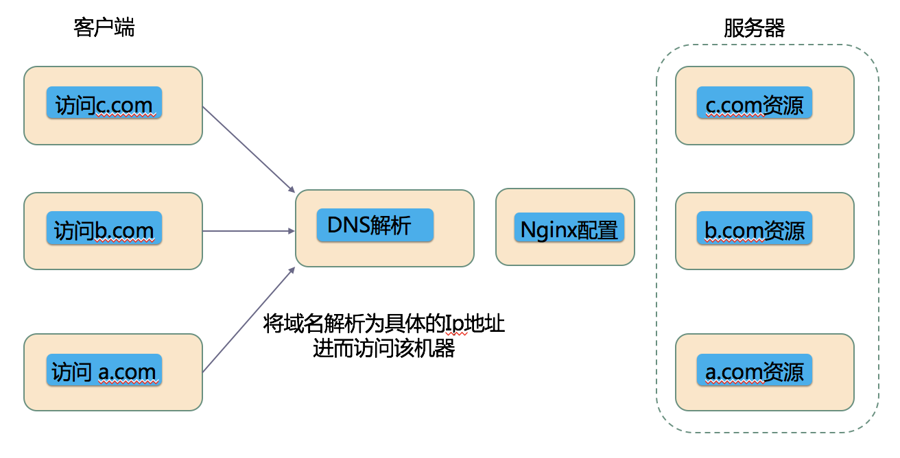

enginx入门

### 1.基础

#### 安装

```
brew install nginx
```

#### 查看安装版本

```
nginx -v
```

#### 启动

```
brew services start nginx
```

打开：http://localhost:8080/  或者在终端 `curl localhost:8080`

#### 配置

`/usr/local/etc/nginx/nginx.conf`

```

```

```
nginx -s signal
```

#### 控制nginx

信号的值可以是以下之一：

- `quit` – 正常地关闭
- `reload` – 重新加载配置文件
- `reopen` – 重新打开日志文件
- `stop` – 立即关闭(快速关闭)

[nginx-菜鸟教程](https://www.runoob.com/w3cnote/nginx-setup-intro.html)

我们知道浏览器地址栏输入url简单经过以下几个步骤

**1.DNS域名解析；**

**dns解析**分为以下几个步骤：

- 先查看**浏览器dns缓存**中是否有域名对应的ip。
- 如果没有，则查看**操作系统dns缓存**中是否有对应的ip（例如windows的hosts文件）。
- 依旧没有就对**本地区的dns服务器**发起请求，
- 如果还是没有，就直接到Root Server域名服务器请求解析

2.建立TCP连接；3.发送HTTP请求；
**4.服务器处理请求；**
5.返回响应结果；6.关闭TCP连接；7.浏览器解析HTML；8.浏览器布局渲染；

主要看下dns域名解析和服务器处理请求

#### DNS域名解析

修改 `/private/etc/hosts` 文件，增加如下映射

```
127.0.0.1	localhost
127.0.0.1	www.a.com
127.0.0.1	www.b.com
127.0.0.1	www.b.com
```

可以看到此时访问 `www.a.com ` 域名对应的ip地址是本机的ip;

```
ping www.a.com 
PING www.a.com (127.0.0.1): 56 data bytes
```

#### 服务器处理请求(本机处理请求)

启动nginx服务,修改`/usr/local/etc/nginx/nginx.conf` ,然后重新启动服务 `nginx -s reload`

```
server {
        listen 8100;
        server_name www.a.com;
	    location / {
            proxy_pass https://cn.bing.com/;   
            # root   html;
            # index  index.html index.htm;
        } 
	}
    server {
        listen       8080;
        server_name  localhost;

        #charset koi8-r;

        #access_log  logs/host.access.log  main;

        location / {
            root   html;
            index  index.html index.htm;
        }
     }
```

此时我们访问`www.a.com` 会看到被代理到了 `https://cn.bing.com/`,此时的服务器可以理解为就是本机。



一台机器(服务器)可以理解部署多个网站（域名），两个域名解析到同一个ip地址，但是用户通过两个域名却可以完全打开两个不同的网站，互相不影响，就像访问两个服务器一样，所以叫做两个虚拟主机。

此时我们在浏览器中随便看一个请求的具体信息

```
General
  Request URL: http://www.a.com:8100/rp/2ajnlX1juJQ_Nu80sW46BDUL1-A.gz.js
  Request Method: GET
  Status Code: 200 OK (from disk cache)
  Remote Address: 127.0.0.1:8100
  Referrer Policy: no-referrer-when-downgrade
Response Headers
  Cache-Control: public, max-age=15552000
  Content-Encoding: gzip
  Content-Length: 3963
  Content-Type: application/x-javascript; charset=utf-8
  Date: Thu, 07 May 2020 05:08:06 GMT
  ETag: 0x8D7D6C2C2E81580
  Last-Modified: Thu, 02 Apr 2020 05:00:27 GMT
  Server: nginx/1.17.6
  Vary: Origin
  X-Azure-Ref-OriginShield: Ref A: 0DA61F30F6344B62979BA8774C87C218 Ref B: RIO01EDGE0220 Ref C: 2020-04-30T17:30:24Z
  X-Cache: TCP_HIT
  x-ms-blob-type: BlockBlob
  x-ms-lease-status: unlocked
  x-ms-request-id: 1f6bea87-101e-00f6-0515-1f4238000000
  x-ms-version: 2009-09-19
  X-MSEdge-Ref: Ref A: 792314C10CCD4812B000F9914C66C274 Ref B: BJ1EDGE0207 Ref C: 2020-05-07T05:08:06Z
Request Headers
  Origin: http://www.a.com:8100
  Referer: http://www.a.com:8100/
  User-Agent: Mozilla/5.0 (Macintosh; Intel Mac OS X 10_13_6) AppleWebKit/537.36 (KHTML, like 	Gecko) Chrome/81.0.4044.129 Safari/537.36
```

nginx除了可以直接代理域名，也可以代理多态机器


### 2.docker中使用nignx

首先要 [学习docker](https://yeasy.gitbook.io/docker_practice/)

然后在docker中启动nginx，[参考](https://www.runoob.com/docker/docker-install-nginx.html)

默认配置路径

```
/etc/nginx
```

默认展示文件路径

```
/usr/share/nginx/html/
```

**目录解释**

| 路径                                                         | 类型           | 作用                                       |
| ------------------------------------------------------------ | -------------- | ------------------------------------------ |
| /etc/logrotate.d/nginx                                       | 配置文件       | nginx日志轮转，用于logrotate服务的日志切割 |
| /etc/nginx  /etc/nginx/conf.d  /etc/nginx/conf.d/default.conf   /etc/nginx/nginx.conf | 目录、配置文件 | nginx主配置文件                            |
| /etc/nginx/fastcgi_params  /etc/nginx/scgi_params   /etc/nginx/uwsgi_params | 配置文件       | cgi配置相关，fastcgi配置                   |
| /etc/nginx/koi-utf   /etc/nginx/koi-win   /etc/nginx/win-utf | 配置文件       | 编码映射转化文件                           |
| /etc/nginx/mime.types                                        | 配置文件       | 设置http协议的Content-Type与扩展名对应关系 |
| /etc/sysconfig/nginx   /etc/sysconfig/nginx-debug   /usr/lib/systemd/system/nginx-debug.service  /usr/lib/systemd/system/nginx.service | 配置文件       | 用于配置出系统守护进程管理器管理方式       |
| /etc/nginx/modules   /usr/lib64/nginx/modules                | 目录           | nginx模块目录                              |
| /usr/sbin/nginx   /usr/sbin/nginx-debug                      | 命令           | nginx服务的启动管理的终端命令              |
| /usr/share/doc/nginx-1.12.2   /usr/share/doc/nginx-1.12.2/COPYRIGHT   /usr/share/man/man8/nginx.8.gz | 文件目录       | nginx的手册和帮助文件                      |
| /var/cache/nginx                                             | 目录           | nginx的缓存目录                            |
| /var/log/nginx                                               | 目录           | nginx的日志目录                            |


修改`nginx.conf` 配置文件，由于nignx镜像没有vim，需要手动安装vim.

nginx.conf配置文件在 /etc/nginx/ 下面，但是你使用vim nginx.conf 或者vi nginx.conf

会发现vi或者vim命令没有用，解决办法：apt-get update 完成之后 apt-get install vim


[nginx 负载均衡](https://www.jianshu.com/p/50dfb0d69983)

[nginx基础教程](https://www.w3cschool.cn/nginx/nginx-d1aw28wa.html)