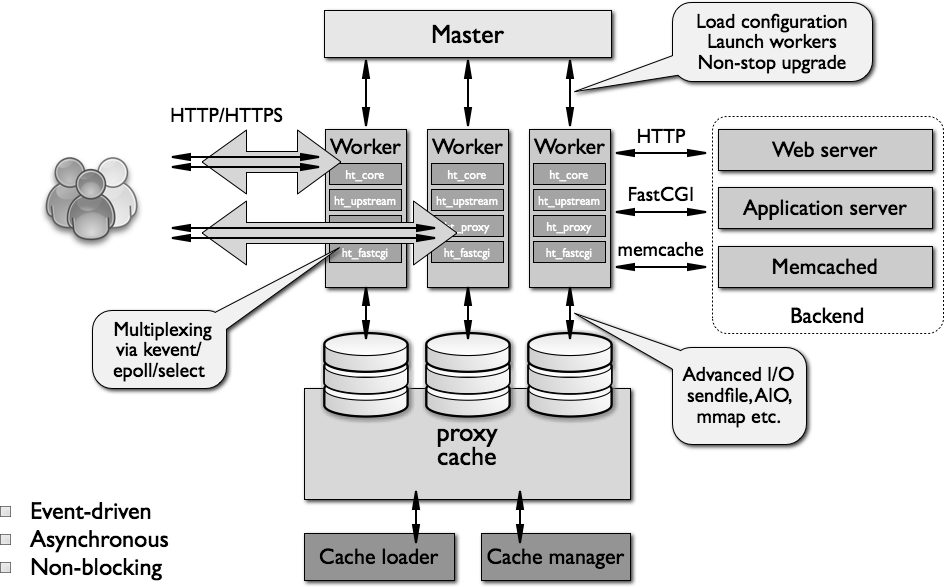

---
titile:浅谈nginx设计
---

### 1.整体架构

#### 1.1.1 主进程

Nginx 启动时，会生成两种类型的进程，一个是主进程（master），一个或多个工作进程（worker）。主进程并不处理网络请求，主要负责调度工作进程（加载配置、启动工作进程及非停升级），所以Nginx启动以后，查看操作系统的进程列表，至少有两个 Nginx 进程。

#### 1.1.2 工作进程

服务器实际处理网络请求及响应的是工作进程，而每个 worker 进程都可以同时处理数以千计的网络请求（配置文件可配）。

#### 1.1.3 模块化设计

Nginx 的worker进程，包括核心和功能性模块，核心模块负责维持一个运行循环（run-loop），执行网络请求处理的不同阶段的模块功能，比如：网络读写、存储读写、内容传输、外出过滤，以及将请求发往上游服务器 等。而其代码的 模块化设计，也使得我们可以根据需要对功能模块进行适当的选择和修改，编译成具有特定功能的服务器。

#### 1.1.4 事件驱动模型

基于异步及非阻塞的事件驱动模型，可以说是Nginx得以获得高并发、高性能的关键因素，同时也得益于对 Linux、Solaris 及类 BSD 等操作系统内核中 事件通知 及 I/O 性能增强功能 的采用，如 kqueue、epoll 及 event ports。

#### 1.1.5 代理设计

无论是对于 HTTP，还是对于 FastCGI、Memcache、Redis 等的网络请求或响应，本质上都采用了代理机制。

#### 1.1.6 缓存设计

Nginx的Web缓存服务主要由proxy_cache相关指令集和fastcgi_cache相关指令集构成，前者用于反向代理时，对后端内容源服务器进行缓存，后者主要用于对FastCGI的动态程序进行缓存。

nginx的缓存功能有：proxy_cache / fastcgi_cache

- proxy_cache的作用是缓存后端服务器的内容，可能是任何内容，包括静态的和动态。proxy_cache缓存减少了nginx与后端通信的次数，节省了传输时间和后端宽带。
- fastcgi_cache的作用是缓存fastcgi生成的内容，很多情况是php生成的动态的内容。fastcgi_cache缓存减少了nginx与php的通信的次数，更减轻了php和数据库(mysql)的压力

### 2.基本配置

整体来说，nginx配置文件主要包含以下几块：全局块，event块，http块{ server块 {location块} }

1、全局块：配置影响nginx全局的指令。一般有运行nginx服务器的用户组，nginx进程pid存放路径，日志存放路径，配置文件引入，允许生成worker process数等。

2、events块：配置影响nginx服务器或与用户的网络连接。有每个进程的最大连接数，选取哪种事件驱动模型处理连接请求，是否允许同时接受多个网路连接，开启多个网络连接序列化等。

3、http块：可以嵌套多个server，配置代理，缓存，日志定义等绝大多数功能和第三方模块的配置。如文件引入，mime-type定义，日志自定义，是否使用sendfile传输文件，连接超时时间，单连接请求数等。

4、server块：配置虚拟主机的相关参数，一个http中可以有多个server。

5、location块：配置请求的路由，以及各种页面的处理情况