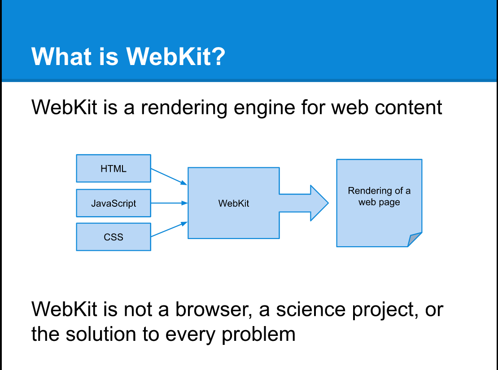
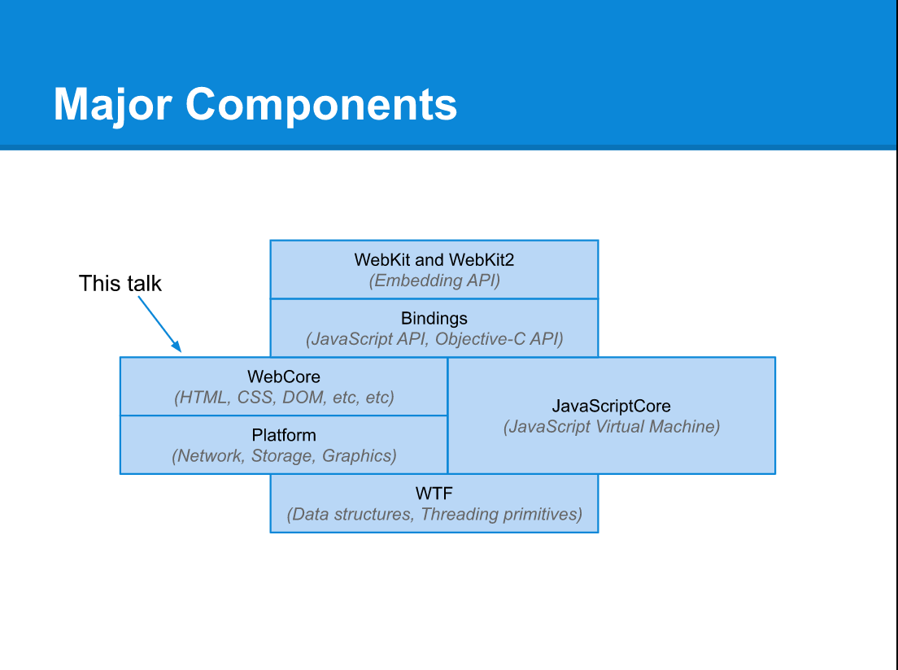
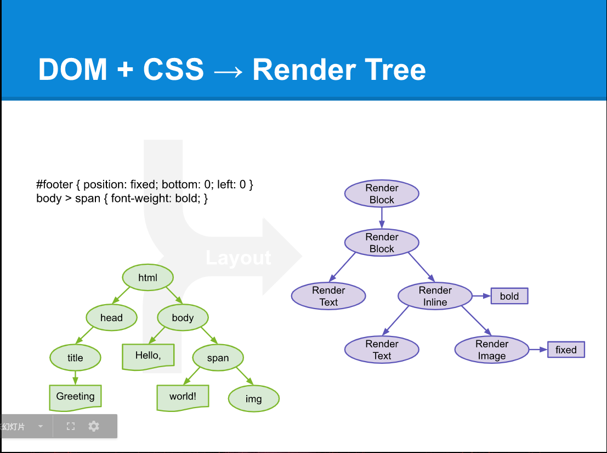
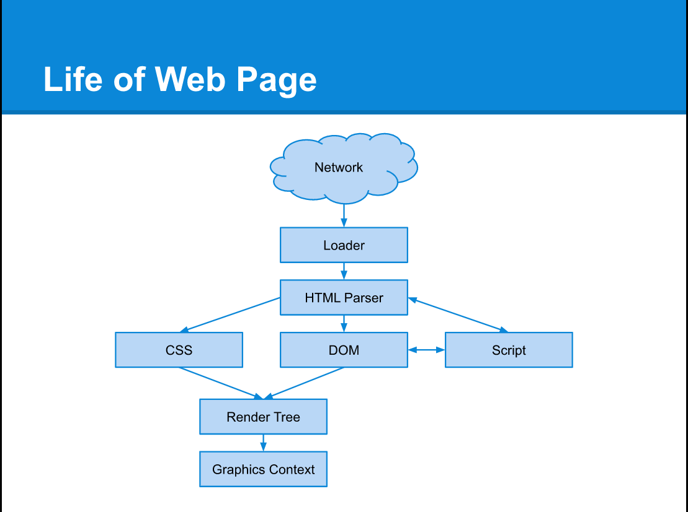
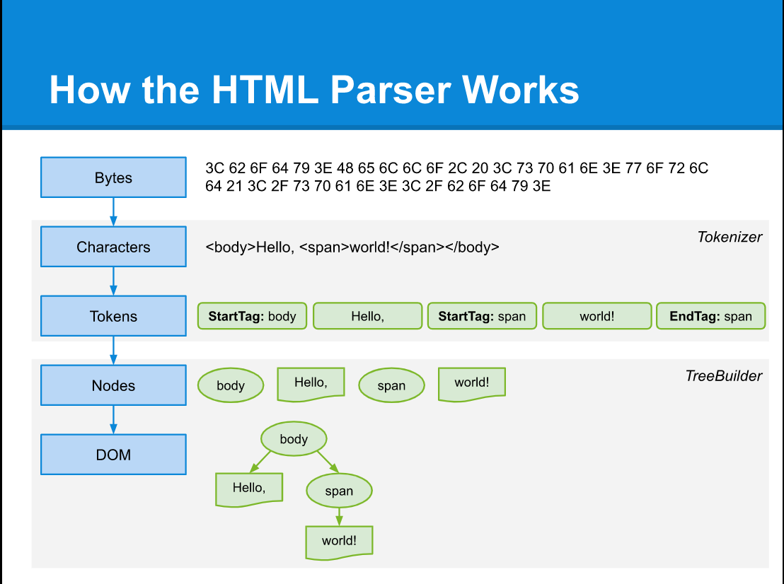
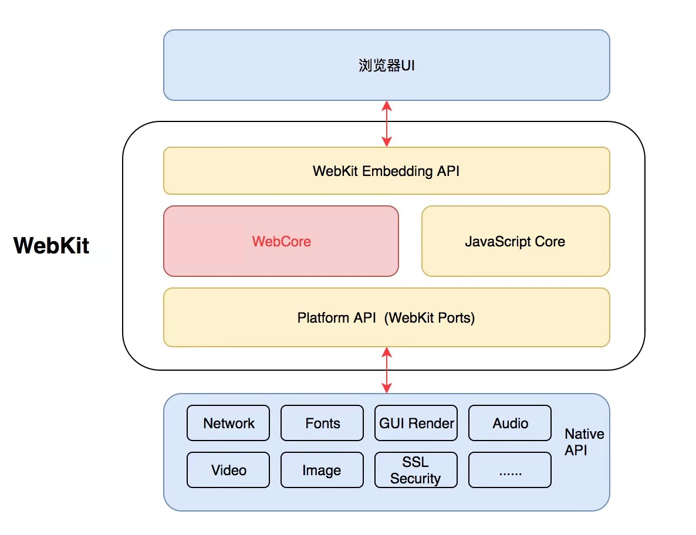
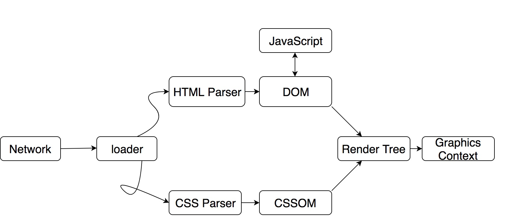
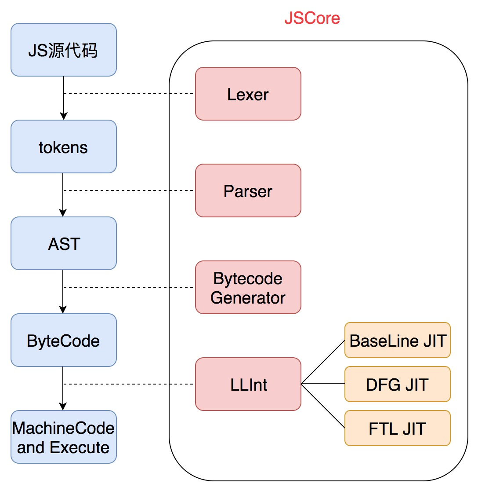

---
title:WebKit是如何工作的？
---

### 0.浏览器内核-JS引擎

### Browser engine

浏览器内核，浏览器引擎(Browser engine)，也称排版引擎(layout engine)、页面渲染引擎(rendering engine)。浏览器内核无非需要以下几个主要部分，如 HTML/CSS 解析器，网络处理，JavaScript 引擎，2D/3D 图形引擎，多媒体支持等。

|  内核   |                            浏览器                            | 发布年份 | 发布厂商  | 维护状态 | JavaScript 引擎 |
| :-----: | :----------------------------------------------------------: | :------: | :-------: | :------: | :-------------: |
| Trident |                    IE4 - IE11、360 浏览器                    |   1997   | Microsoft |   停止   | JScript/Chakra  |
|  Gecko  |                           Firefox                            |   2004   | Netscape  |   维护   |  SpiderMonkey   |
| WebKit  | Safari、Chromium、Chrome(-2013)、Android 浏览器、Chrome OS、Web OS 等 |   2005   |   Apple   |   维护   | JavascriptCore  |
|  Blink  |                    Chrome(2013-)、 Opera                     |   2013   |  Google   |   维护   |       V8        |
|  Edge   |                             Edge                             |   2015   | Microsoft |   停止   |     Chakra      |

### JavaScript Engine

目前在 Android／iOS 上运行 JavaScript，主要有两种方法：一种方法是利用系统的浏览器组件 WebView（Android）和 UIWebView／WKWebView（iOS）；另一种方法是编译和集成一个功能全面的 JavaScript 引擎。JavaScript 引擎是一个专门处理 JavaScript 脚本的虚拟机，一般会附带在网页浏览器之中。

| JavaScript Engine |       Android       |               iOS               |  维护厂商/个人  |
| :---------------: | :-----------------: | :-----------------------------: | :-------------: |
|        V8         |         JIT         | JIT only for jailbroken devices |     Google      |
|  JavaScriptCore   | Interpreter and JIT |        Interpreter only         |      Apple      |
|   SpiderMonkey    | Interpreter and JIT |        Interpreter only         |     Mozilla     |
|       Rhino       |     Interpreter     |           Unsupported           |     Mozilla     |
|      quickjs      |          -          |                -                | Fabrice Bellard |

### 1.什么是WebKit

### 2.Major-component

### 3.Render-tree

### 4.pageLife

### 5.HTML-parser

### 6.How WebKits Works

WebKit 就是一个页面渲染以及逻辑处理引擎，前端工程师把 HTML、JavaScript、CSS 这“三驾马车”作为输入，经过 WebKit 的处理，就输出成了我们能看到以及操作的 Web 页面。从上图我们可以看出来，WebKit 由图中框住的四个部分组成，而其中最主要的就是 WebCore（KDE 开发的排版引擎） 和 JSCore（或者是其它 JS 引擎）。除此之外，WebKit Embedding API 是负责浏览器 UI 与 WebKit 进行交互的部分，而 WebKit Ports 则是让 Webkit 更加方便的移植到各个操作系统、平台上，提供的一些调用 Native Library 的接口，比如在渲染层面，在 iOS 系统中，Safari 是交给 CoreGraphics 处理，而在 Android 系统中，Webkit 则是交给 Skia。

#### 排版引擎 WebCore 的工作流程:

#### JavaScript 引擎 JSCore 的工作流程:

